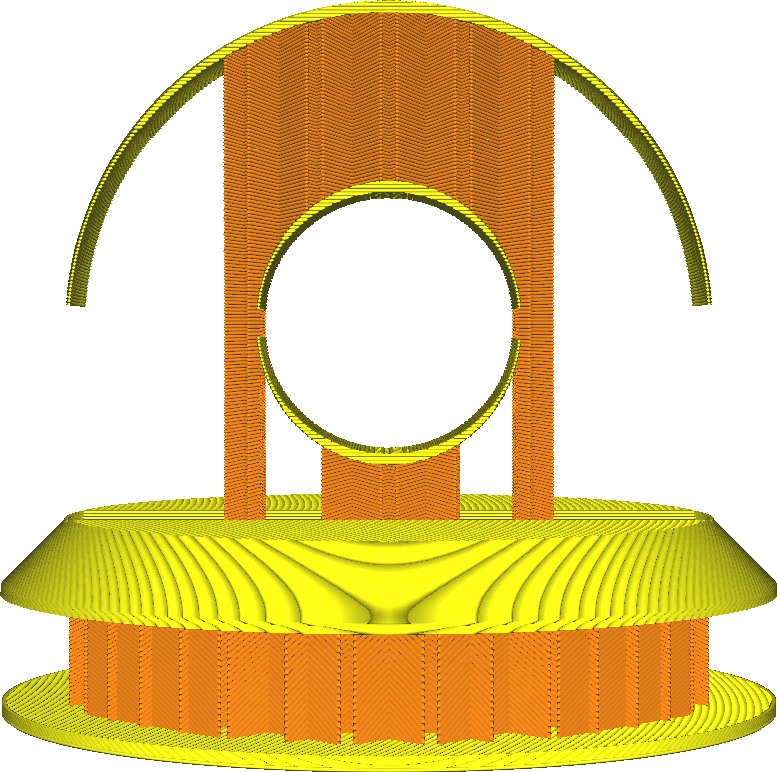

Angle de porte-à-faux de remplissage
====
Lors de l'utilisation d'un support de remplissage, ce réglage détermine l'angle de surplomb minimum de la surface qui doit être soutenue. Il est similaire au paramètre [Angle de porte-à-faux de support](../support/support_angle.md) pour un support ordinaire.

En augmentant cet angle, la structure de support supportera moins la surface supérieure. Cela permet d'économiser du temps et de la matière, mais la peau supérieure s'affaisse un peu plus.
* Une valeur de 0° agira comme un remplissage normal. Il supporte tout.
* Une valeur de 90° enlèvera tout le matériau de remplissage.
