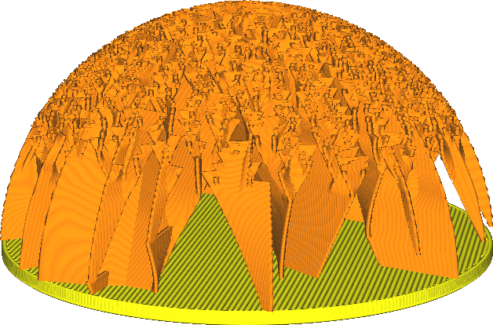
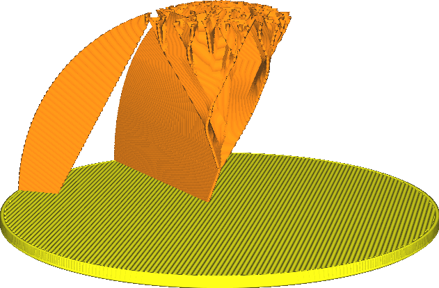

Angle de surplomb du remplissage Eclair
====
Le remplissage de type Eclair ne soutiendra que la face supérieure du modèle depuis l'intérieur où elle est dans le vide. Ce paramètre détermine l'angle du surplomb qui est soutenu par le remplissage Eclair depuis l'intérieur du modèle.

L'augmentation de cet angle réduira la quantité de remplissage générée. Une moindre partie de la surface supérieure sera soutenue, s'il ne s'agit pas d'un surplomb très important. Cela permet d'économiser du temps et des matériaux, mais peut également entraîner un affaissement de la surface supérieure par endroits. Le résultat pourrait être un défaut de type [matelassage](../troubleshooting/pillowing.md) ou généralement une surface moins lisse.

Contrairement au réglage parent [Angle support du remplissage Eclair](lightning_infill_support_angle.md), ce paramètre n'a pas d'influence sur le surplomb dans le motif de remplissage lui-même.
