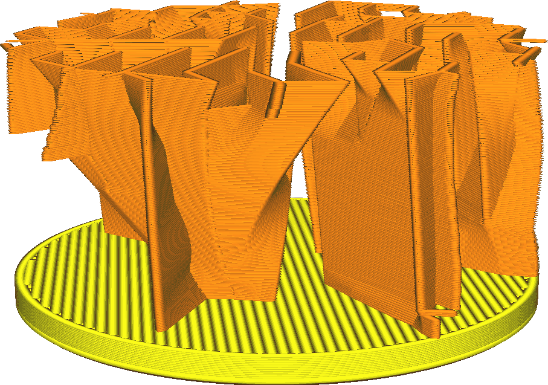
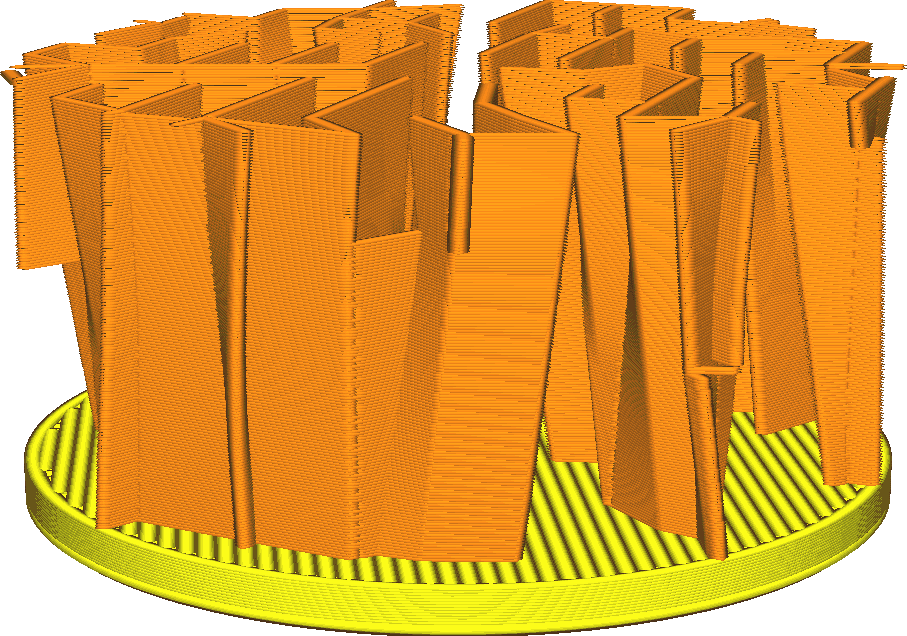

Angle de redressement du remplissage Eclair
====
Ce paramètre détermine la pente du motif de remplissage Eclair qui peut déborder à l'intérieur.

Le remplissage Eclair produit des lignes en zigzag ressemblant à des éclairs là où il doit soutenir le haut de l'impression, mais ces lignes prennent beaucoup de temps à imprimer en raison de leurs angles aigus. Ainsi, en bas, il tentera de redresser ces lignes en dents de scie, afin de réduire le temps d'impression. Ce redressement entraîne des dépouilles. Le paramètre détermine la quantité de dépouille autorisée.

Le fait de redresser rapidement (augmentation du surplomb) réduit quelque peu le temps d'impression, mais réduit également la fiabilité de l'impression, en particulier pour les lignes de faible largeur. Si le surplomb est trop important, il en résulte une division de la couche. La séparation se trouve à l'intérieur de l'impression et ne pose souvent pas de problème, mais elle peut entraîner une défaillance complète d'une partie du remplissage, ce qui fait qu'une partie de la face supérieure n'est pas soutenue. Cela sera alors visible sous la forme d'une tache  ou d'un affaissement sur le dessus, ou même d'un amas de plastique dans le pire des cas.
