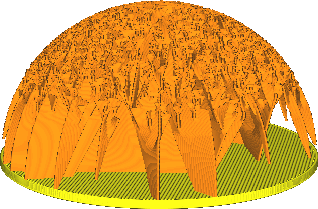

Angle de porte-à-faux du remplissage Eclair
====
Le motif de remplissage Eclair est uniquement destiné à soutenir l'impression des zones internes. Ce paramètre détermine l'angle maximal de surplomb, non seulement des surfaces qu'il supportera, mais aussi de l'intérieur du remplissage lui-même. Si vous réduisez ce paramètre, le remplissage sera plus important. En l'augmentant, vous réduisez la quantité de remplissage.

Le motif soutient la face supérieure de l'impression de l'intérieur, pour toutes les faces qui sont en surplomb au-delà de cet angle. Le motif comporte également des ramifications  qui sont créées avec un certain angle pour créer une structure arborescente ramifiée. Les faces latérales de cette structure ramifiée ont aussi un angle de dépouille pour atteindre plus loin certaines zones. Ces trois aspects du porte-à-faux peuvent également être contrôlés individuellement avec les paramètres [Angle de dépouille du remplissage Eclair](lightning_infill_overhang_angle.md), [Angle de ramification du remplissage Eclair](lightning_infill_prune_angle.md) et [Angle de redressement du remplissage Eclair](lightning_infill_straightening_angle.md) respectivement.

En augmentant ce paramètre, vous réduirez considérablement la quantité de matériau nécessaire et le temps d'impression. Cependant, cela entraîne également un affaissement. Cet affaissement se situe à l'intérieur du modèle, il n'est donc pas immédiatement visible. Cependant, si l'[Épaisseur du dessus](../top_bottom/top_thickness.md) n'est pas suffisante, elle peut conduire à du [matelassage](../troubleshooting/pillowing.md). Étant donné que les angles internes du remplissage sont également autorisés à déborder davantage, il est probable que le remplissage commence plus haut le long des murs.
