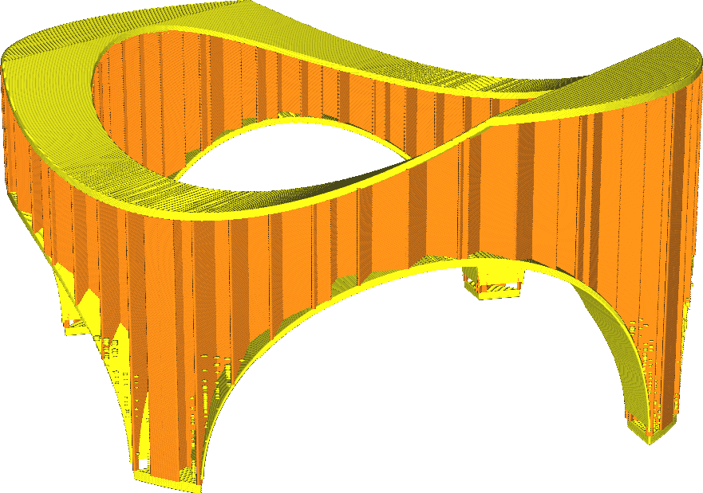

Zone de remplissage minimum
====
Ce réglage fait que de très petites pièces sont remplies avec le motif de la peau plutôt qu'avec le motif de remplissage, ce qui les rend complètement solides.

Parfois, de très petites zones creuses ne peuvent pas être correctement remplies avec du matériau de remplissage, car les lignes de remplissage seraient si courtes que le matériau n'aurait pas le temps de s'écouler correctement. Ce réglage les remplit plutôt avec de la peau, ce qui les rend plus résistantes et empêche la formation d'une séparation entre la peau et le matériau de remplissage.

Le réglage de ce paramètre sur 0 désactive cette fonction.
