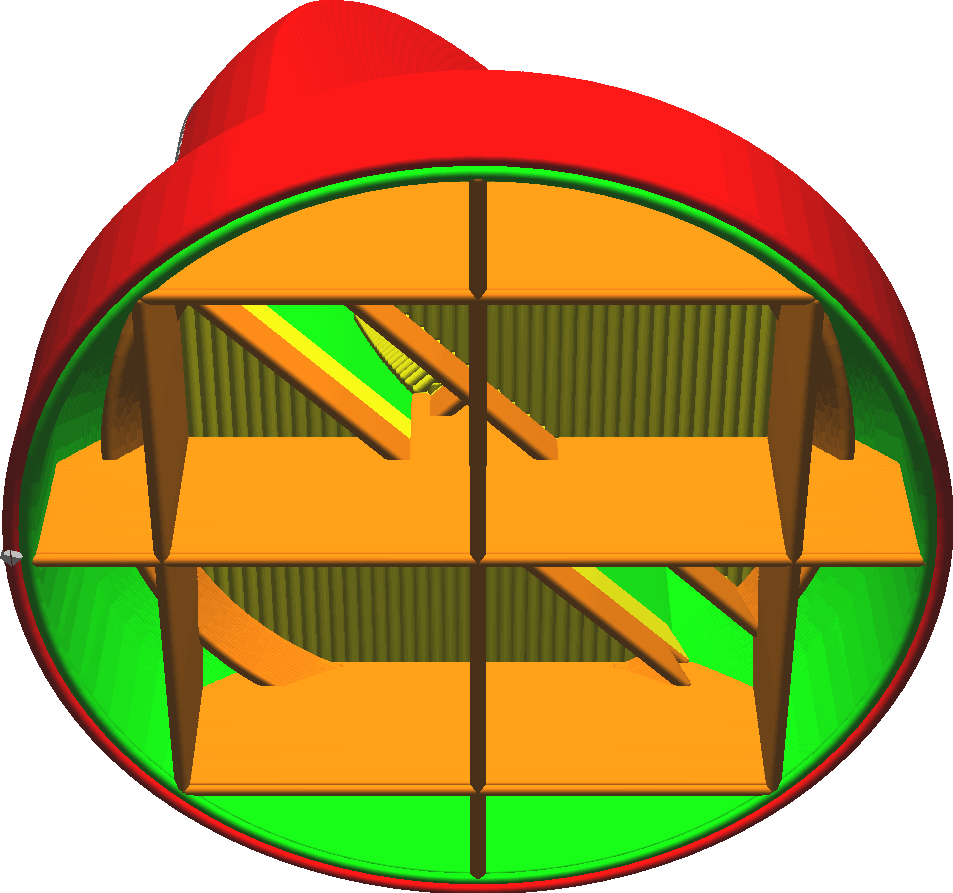

Lors de l'impression de formes concaves, il y aura une peau supérieure qui se terminera quelque part à mi-chemin du remplissage. Ce réglage ajoute une ligne supplémentaire à travers le remplissage pour soutenir le bord de la peau, de sorte qu'elle s'affaisse un peu moins.

Une seule ligne à travers les interstices du remplissage s'affaissera toujours, de sorte que la ligne peut être tracée sur plusieurs couches sous le bord de la peau qui a besoin d'être soutenue. Ce paramètre permet de configurer le nombre de couches à travers lesquelles cette ligne sera tracée sous le bord de la peau. Vous pouvez également ajuster l'[épaisseur](skin_edge_support_thickness.md) des couches à travers lesquelles la ligne est tracée.

L'augmentation du nombre de calques aura généralement les effets suivants sur l'impression :
* Le bord de la peau sera mieux supporté, ce qui donnera une face supérieure plus lisse car la peau peut passer complètement d'un côté à l'autre.
* L'impression prend un peu plus de temps et utilise plus de matière.

Si le taux de remplissage est élevé, ce réglage n'aura pratiquement aucun effet sur la surface supérieure et pourrait provoquer une [surextrusion](../troubleshooting/overextrusion.md) dans le remplissage. Il est donc préférable de laisser la couche 0.
