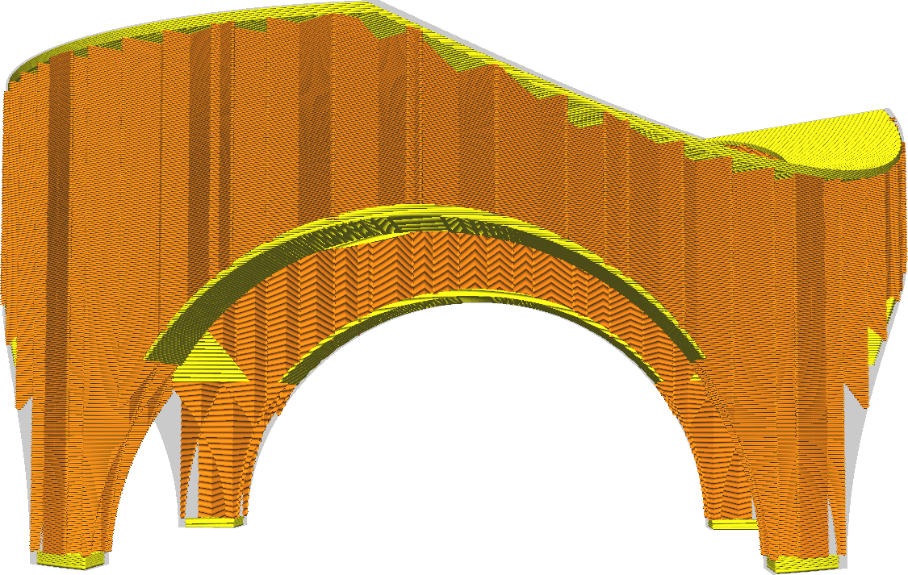

Élargissez ou réduisez les couches solides sur le dessus de votre impression dans le sens horizontal. Normalement, les couches solides ne sont générées qu'en dessous des parties où il y a de l'air, mais avec ce réglage, vous pouvez l'élargir horizontalement un peu plus, ce qui améliore la résistance en faisant en sorte que la peau s'attache mieux aux murs adjacents et en fermant les interstices de la peau.

* Si vous avez de petits trous dans les couches supérieures de la peau (trous qui sont remplis avec le motif de remplissage), le fait de régler ce paramètre un peu plus haut les fermera. Cela permet à l'imprimante d'imprimer en continu les lignes du bas, ce qui améliore considérablement la résistance.
* Si la face inférieure de votre impression n'est pas plate, augmenter ce réglage entraînera l'impression de la peau au-delà de la zone qui se trouve directement au-dessus de l'air, au-dessus des murs. Cela améliorera l'adhérence entre la peau et les parois, ce qui améliorera encore la résistance.
* Si vous réglez ce paramètre sur une valeur négative, la largeur des couches inférieures sera réduite et remplacée par un remplissage. Cela peut permettre de gagner du temps d'impression, au détriment de la résistance.

**En raison de limitations techniques, vous ne pouvez pas réduire ce paramètre en dessous de la valeur de [Top Skin Removal Width](top_skin_preshrink.md). Augmentez le paramètre Top Skin Removal Width afin d'enlever plus de peau.**
