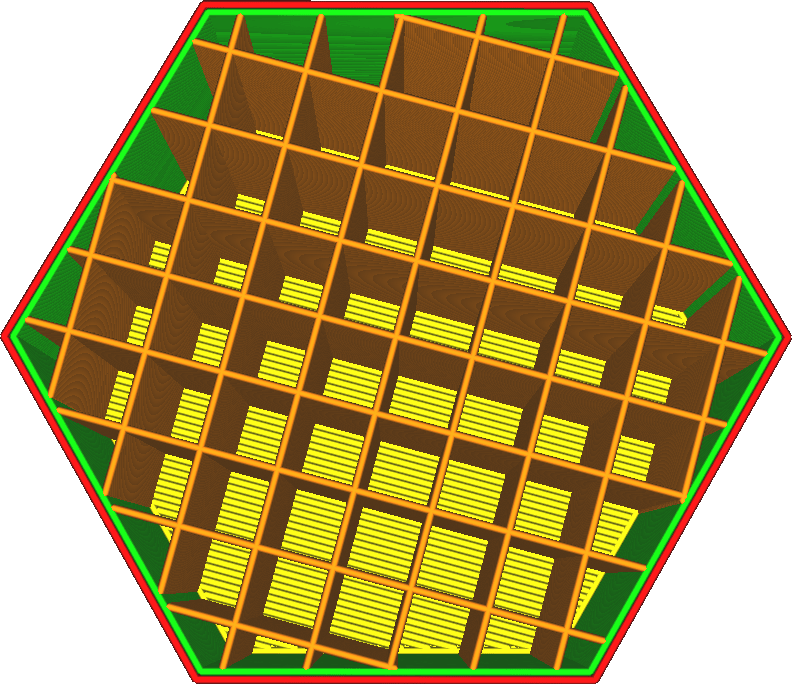
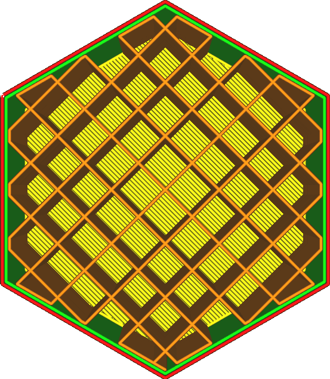

Thirelie les points d'extrémité du modèle de remplissage, où le remplissage rencontre la paroi intérieure ou la peau, à l'aide d'une ligne qui suit le bord de la zone de remplissage.

Cela permet de convertir l'ensemble du schéma de remplissage en une seule ligne ou en très peu de lignes. La conversion en une seule ligne n'est pas toujours possible. Le point de départ de cette ligne est arbitraire, il peut donc ne pas être le même pour chaque couche, surtout si la forme du remplissage est différente d'une couche à l'autre.

Le raccordement du remplissage présente quelques avantages, mais aussi quelques inconvénients :
* Votre pièce sera plus solide au final, puisqu'il y a pratiquement un demi-contour en plus.
* Le matériau de remplissage adhère mieux aux parois grâce à l'augmentation de la surface, ce qui rend la pièce plus résistante.
* Le débit sera maintenu plus constant, ce qui vous permettra d'imprimer le remplissage à une plus grande vitesse sans problème d'écoulement. Ceci est particulièrement important pour les matériaux qui sont difficiles à extruder correctement.
* Le nombre de retraits effectués pendant l'impression est nettement inférieur, ce qui empêche le matériau de se broyer.
* L'effet du paramètre [Pourcentage de chevauchement du remplissage](./infill_overlap.md) est amplifié, car une plus grande partie des lignes de remplissage chevauchent les parois.
* Il faudra plus de matière pour imprimer le remplissage.
* Il faut généralement plus de temps pour imprimer le remplissage, car les déplacements sont normalement plus rapides que l'impression des lignes de remplissage.
* Le remplissage brillera généralement plus à travers les murs, car il sera poussé dans une plus grande partie des murs.
