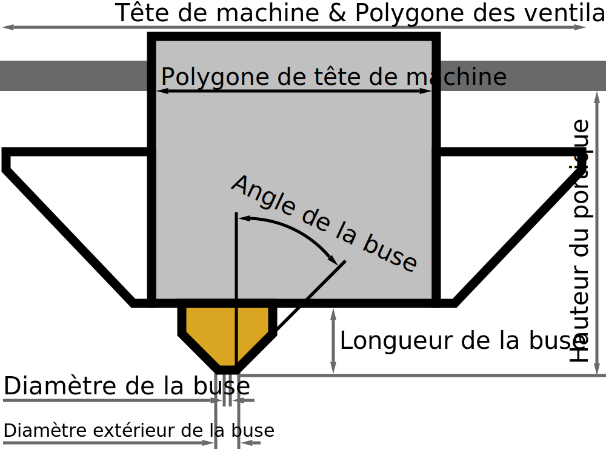

Hauteur du portique
====
Ce réglage mesure la distance entre le plateau d'impression et le système de portique auquel la tête d'impression est suspendue. Cette hauteur est une limite lorsque vous imprimez [un objet à la fois](../blackmagic/print_sequence.md), car les objets précédemment imprimés pourraient entrer en collision avec le portique.

La plupart des imprimantes 3D ont leur tête d'impression suspendue à une ou deux barres transversales. La forme de ce portique n'est pas modélisée par Cura : qu'il s'agisse de deux barres transversales, d'un seul bras venant d'une direction ou d'une seule barre transversale le long de laquelle la tête d'impression peut se déplacer dans une direction. Cura considère ce portique comme une limite de la matière lorsqu'il imprime [un objet à la fois](../blackmagic/print_sequence.md), quel que soit l'ordre dans lequel les modèles sont imprimés. Lors de l'impression d'[un objet à la fois](../blackmagic/print_sequence.md), la hauteur du volume de construction est limitée à cette hauteur de portique, pour indiquer qu'aucun modèle plus haut que la hauteur du portique n'est autorisé.

Une exception est faite lorsqu'un seul objet est chargé sur la plaque de construction. Cet objet est autorisé à être plus haut que la hauteur du portique car il n'y aura alors rien d'autre sur la plaque de construction qui puisse entrer en collision avec le portique.

*Comme il s'agit d'un réglage de machine, il ne figurera normalement pas dans la liste normale des réglages. La hauteur du portique peut être modifiée dans la boîte de dialogue des paramètres de l'imprimante, qui se trouve dans la liste des imprimantes ajoutées dans la boîte de dialogue des préférences.*
