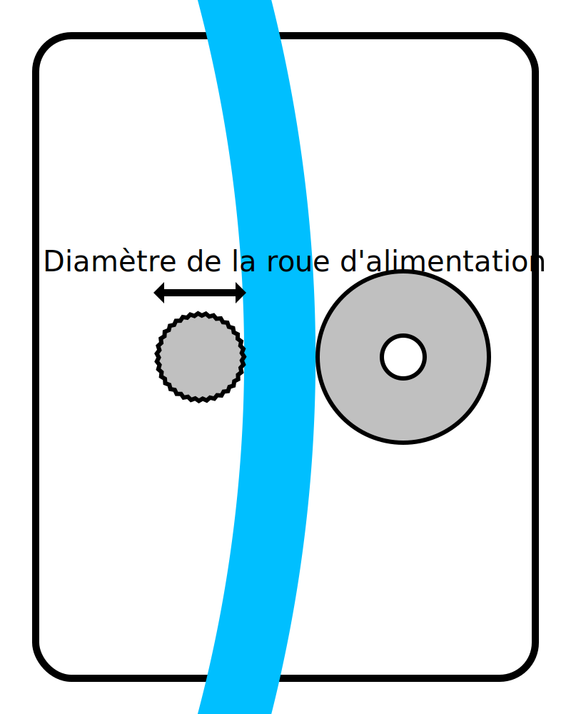

Diamètre de la roue d'alimentation
====
Ce réglage est une mesure du diamètre de la roue qui déplace le filament d'avant en arrière à l'intérieur de l'alimentateur.

Ce paramètre n'est pas du tout utilisé par Cura. Cependant, il est utilisé par le plug-in X3GWriter afin de contrôler correctement le chargeur. Il doit savoir à quelle vitesse déplacer le chargeur afin de déplacer le filament à la bonne distance.

*Comme il s'agit d'un réglage de la machine, ce réglage n'est normalement pas visible dans la liste des réglages.*
