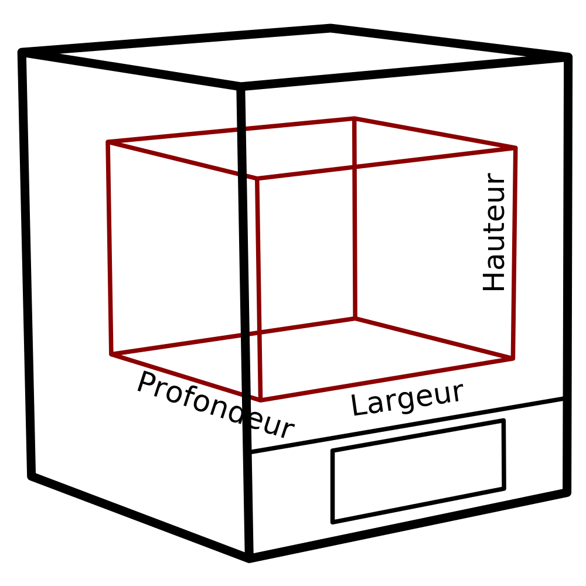

Hauteur de la machine
====
Ce réglage indique la plage verticale des coordonnées Z à travers laquelle la ou les buses peuvent se déplacer. Il s'agit essentiellement de la taille utilisable de l'imprimante.

Elle n'est pas égale à la hauteur réelle de votre imprimante sur l'étagère. L'imprimante réelle aura également un portique ou un bras et une base autour de son volume de construction, et cette mesure n'inclut pas cette taille. Il s'agit seulement de la taille du volume de construction, des coordonnées où la buse pourrait se déplacer.

*Comme il s'agit d'un réglage de la machine, il ne figurera pas normalement dans la liste normale des réglages. La hauteur peut être modifiée dans la boîte de dialogue des paramètres de l'imprimante, qui se trouve dans la liste des imprimantes ajoutées dans la boîte de dialogue des préférences.*
