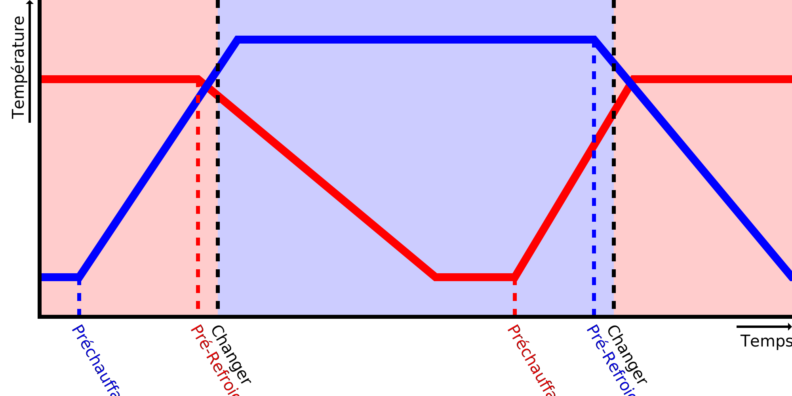

Vitesse de chauffe
====
Ce réglage indique à Cura à quelle vitesse votre imprimante peut chauffer cette buse. Il sert à prédire quand il faut commencer à préchauffer la buse avant de changer d'extrudeuse.

Lorsqu'il change de buse, Cura commence à préchauffer la buse suivante avant qu'elle ne soit utilisée, afin qu'elle soit prête à l'emploi lorsque l'autre extrudeuse vient de terminer. Pour ce faire, elle prendra la différence entre la température actuelle de la buse et la température cible de la buse, et la divisera par la vitesse de chauffage, pour obtenir une durée de préchauffage de la buse.

Si la buse chauffe effectivement plus vite que ce que ce réglage indique, la buse sera à la température cible pendant un certain temps avant que l'autre extrudeuse ne termine l'impression. Pendant ce temps, le matériau suinte et le plastique peut se dégrader un peu dans la buse, ce qui entraîne une [sous-extrusion](../troubleshooting/underextrusion.md).

Si la buse chauffe effectivement plus lentement que ce que ce réglage indique, l'imprimante devra attendre, au niveau de l'interrupteur de l'extrudeuse, que la buse ait atteint la température souhaitée pour l'impression. Cela prendra un peu plus de temps. En outre, l'extrudeuse précédente sera également maintenue à la température finale d'impression pendant cette attente, ce qui l'amènera à suinter davantage de matière et à dégrader à nouveau le plastique de la buse. Ceci est nécessaire pour éviter que le matériau ne refroidisse plus que ce à quoi Cura s'attendait pendant le tranchage, ce qui rendrait la différence de température plus importante que ce à quoi Cura s'attendait et entraîne donc une période d'attente encore plus longue la prochaine fois. Cela conduirait à un effet d'emballement où la prédiction s'aggraverait à chaque couche, de sorte que Cura doit maintenir le matériau précédent chaud jusqu'à ce que la température de l'autre buse soit atteinte.

La vitesse réelle de réchauffement n'est pas un taux constant en degrés par seconde. Il est plus probable qu'elle dépende de la différence entre la température actuelle de la buse et la température du volume de construction. Ainsi, il se réchauffera plus rapidement lorsqu'il fait froid et plus lentement lorsqu'il s'approchera de la température cible. Le régulateur PID de l'imprimante joue également un rôle important à cet égard. La plupart des régulateurs ralentissent le réchauffement juste avant d'atteindre la température cible pour éviter de la dépasser. Si vous réglez ce paramètre, essayez de le régler en mesurant le temps nécessaire pour passer de la [température d'attente](../material/material_standby_temperature.md) à la [température d'impression initiale](../material/material_initial_print_temperature.md). C'est la piste la plus importante que Cura tentera de prévoir. Pour les petits tirages, vous pouvez réduire légèrement la vitesse de chauffe afin d'ajuster la température de départ non pas à la température d'attente mais à une température plus élevée.

*Comme il s'agit d'un réglage de la machine, ce réglage n'est normalement pas visible dans la liste des réglages.*

