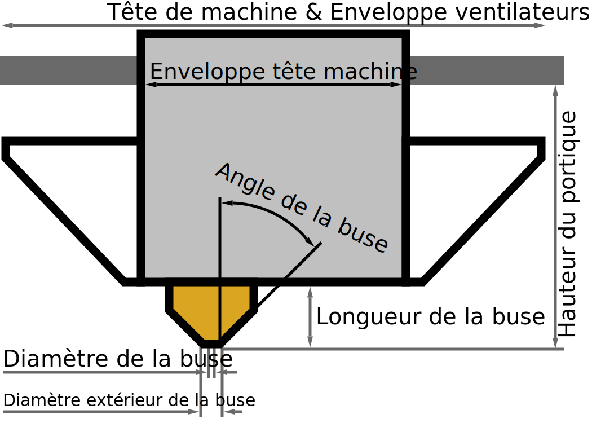

Diamètre extérieur de la buse
====
Ce réglage décrit le diamètre extérieur de la pointe de la buse à son point le plus fin, dans le fond.

D'autres paramètres peuvent l'utiliser pour définir automatiquement certaines valeurs par défaut, comme l'espacement entre les lignes d'étirage.

*Comme il s'agit d'un réglage de machine, ce paramètre n'est normalement pas visible dans la liste des paramètres.*
