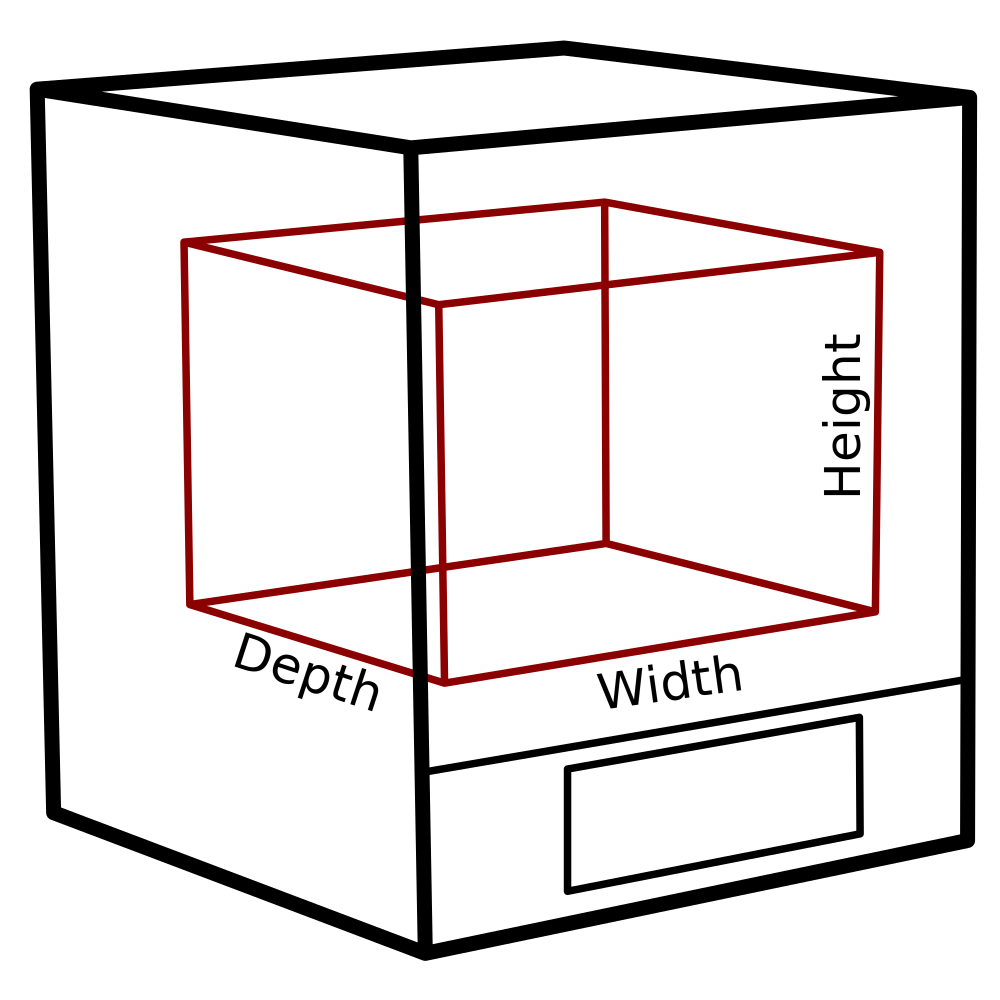

Largeur de la machine
====
Ce réglage indique la plage de coordonnées X à travers laquelle la ou les buses peuvent se déplacer. Il s'agit essentiellement de la taille utilisable de l'imprimante.

Elle n'est pas égale à la largeur réelle de votre imprimante sur l'étagère. L'imprimante réelle aura également un cadre ou un bras autour de son volume de construction, et cette mesure n'inclut pas cette taille. Il s'agit seulement de la taille du volume de construction, des coordonnées où la buse pourrait se déplacer.

Si plusieurs buses sont concernées, il se peut que toutes les buses ne puissent pas atteindre le volume total de la construction. Pour certaines imprimantes, si l'imprimante a différentes buses décalées les unes par rapport aux autres, certaines buses ne pourront pas atteindre tout le volume de production. Ce réglage indique simplement l'union des volumes que toutes les buses sont capables d'atteindre.

*Comme il s'agit d'un réglage de la machine, il ne figurera normalement pas dans la liste normale des réglages. La largeur peut être modifiée dans la boîte de dialogue des paramètres de l'imprimante, qui se trouve dans la liste des imprimantes ajoutées dans la boîte de dialogue des préférences.*
