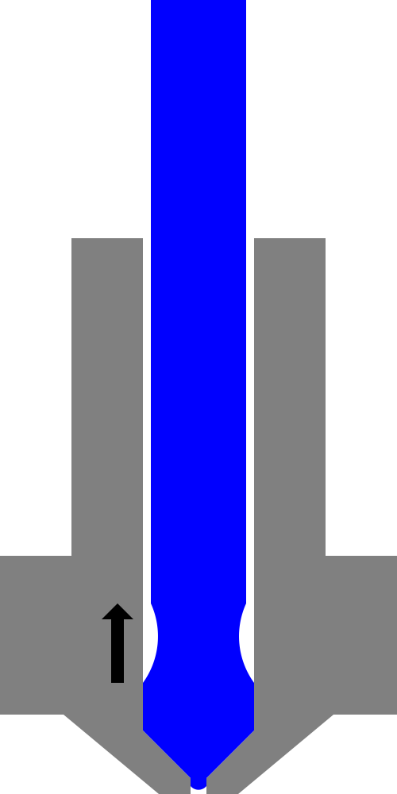

Pour certaines imprimantes, lorsqu'un matériau est rétracté pour un interrupteur à filament, le matériau doit être coupé proprement afin de le faire passer dans le chargeur sans s'emmêler. Ce réglage configure une partie de la procédure pour le rompre proprement.

Ce réglage ajuste la vitesse à laquelle le matériau est rétracté vers la deuxième position pour étirer le matériau en un fil fin. Ce fil fin s'étire hors de la zone chauffée dans la buse, ce qui lui permet de refroidir et de se solidifier. Le fil fin et dur peut ensuite être rompu lors de l'étape suivante de la rétraction.

**Ce paramètre n'est actuellement jamais visible dans l'interface de Cura. Il ne peut être défini que par les profils. Il n'est pas non plus utilisé par Cura pendant le découpage. Cependant, les imprimeurs qui comprennent le format de fichier matériel de Cura peuvent l'utiliser pour configurer correctement leur procédure de changement de filament** Grâce à un script de post-traitement, la commande "M600" peut être insérée dans l'impression, ce qui déclenchera un changement de filament.
