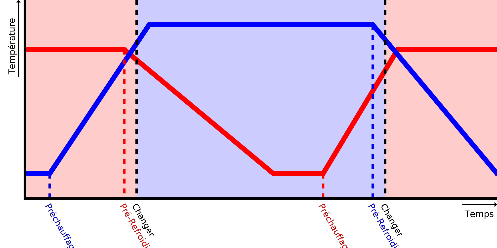

Température de veille
===

Cura suppose que les imprimantes à plusieurs extrudeuses ont des buses séparées qui peuvent avoir des températures différentes. Pendant qu'une extrudeuse est occupée à imprimer, les autres buses doivent être maintenues à une température plus basse afin d'éviter que le matériau dans la chambre de la buse ne se dégrade et ne suinte. Cette température plus basse est la température de veille.

Une bonne température de veille est suffisamment basse pour protéger le filament de la dégradation, qui pourrait boucher la buse. Elle est suffisamment basse pour éviter que la matière ne s'échappe de la buse par suintement. Mais elle est aussi suffisamment élevée pour que l'impression puisse se poursuivre rapidement lorsque les autres extrudeuses ont terminé.
