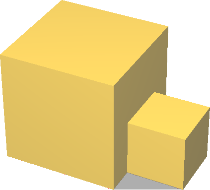
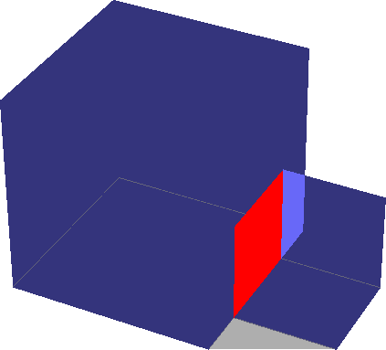
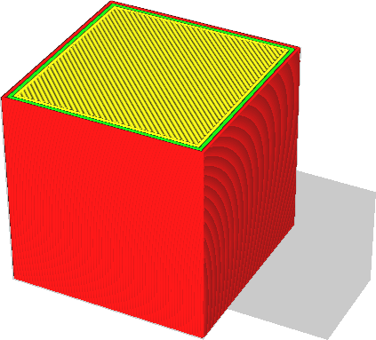
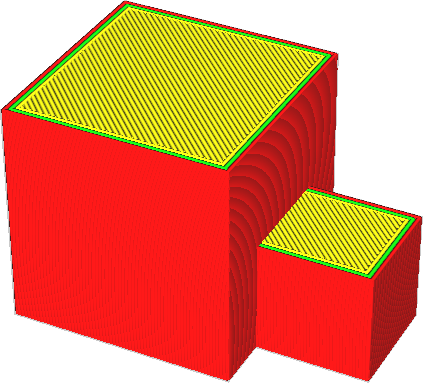

Cura doit savoir où se trouve l'intérieur du modèle afin de le remplir de matériau. Si la surface de votre modèle n'est pas précisément fermée ou comporte des parois internes, il peut être ambigu de savoir où se trouve l'intérieur du modèle.

Un cas fréquent de modèle non multiple est celui où une pièce supplémentaire du modèle est fixée à une partie par ailleurs fermée. Ce cas est fréquent lorsque l'on édite des maillages avec un logiciel de CAO qui n'a pas été conçu pour la fabrication (mais seulement pour le rendu numérique) comme Blender ou SketchUp. Vous pouvez en voir un exemple dans les images ci-dessous.

Ce réglage permet à Cura de mieux tenter de combler les lacunes de la maille si elle n'est pas correctement étanche. Cela augmente les chances d'obtenir une bonne impression, mais augmente le temps de découpe et peut parfois relier les mauvaises surfaces entre elles.
