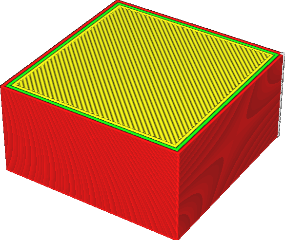

Conserver les faces disjointes
====
Cura a besoin de savoir où se trouve l'intérieur de votre modèle afin de remplir le volume avec du matériel. Si le modèle n'est pas correctement étanche, cela est ambigu. Normalement, Cura n'imprimera pas les parties qui ne sont pas correctement fermées.

Si ce paramètre est activé, les couches dont le périmètre n'est pas correctement fermé seront conservées. Le périmètre sera fermé artificiellement avec une ligne droite. Cela peut permettre de corriger certains modèles qui présentent de petits écarts à la surface. Mais cela peut aussi donner une mauvaise interprétation de l'intérieur de votre modèle.

La vue aux rayons X montrera les lacunes qui peuvent être comblées avec ce réglage en rouge.
