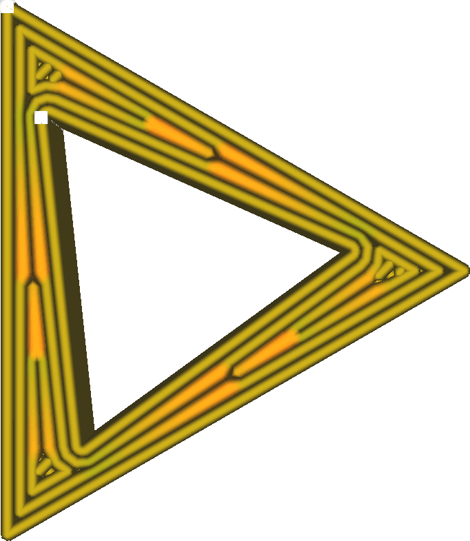

Écart maximal de la surface d'extrusion
====
Lors de l'impression de lignes de différentes largeurs, il est courant d'avoir une ligne qui doit s'amincir progressivement vers l'une de ses extrémités. Ce paramètre détermine la taille de l'étape à laquelle ces lignes s'amincissent ou s'élargissent, en contrôlant la proximité des lignes par rapport à la zone qu'elles devraient idéalement couvrir.

<!--screenshot {
"image_path": "meshfix_maximum_extrusion_area_deviation_high.png",
"models": [{"script": "twisted_triangular_hole.scad"}],
"camera_position": [0, 0, 60],
"settings": {
	"meshfix_maximum_resolution": 0.5,
	"meshfix_maximum_extrusion_area_deviation": 2000
},
"colour_scheme": "line_width",
"colours": 128
}-->
<!--screenshot {
"image_path": "meshfix_maximum_extrusion_area_deviation_low.png",
"models": [{"script": "twisted_triangular_hole.scad"}],
"camera_position": [0, 0, 60],
"settings": {
	"meshfix_maximum_resolution": 0.05,
	"meshfix_maximum_extrusion_area_deviation": 20
},
"colour_scheme": "line_width",
"colours": 128
}-->

Les commandes en code G ne peuvent pas demander à l'imprimante d'imprimer une ligne de largeur variable. Elle doit imprimer les lignes avec une largeur fixe. Cura peut diviser une ligne en plusieurs segments dont la largeur change progressivement. Cependant, cela ajoute beaucoup de segments de ligne à l'impression. L'unité centrale de l'imprimante peut ne pas être en mesure de suivre toutes ces instructions pendant l'impression. Ce paramètre permet de choisir le niveau de détail des segments de ligne à largeur variable. Une résolution plus élevée (écart réduit) permet d'obtenir des lignes plus précises en théorie, mais augmente aussi considérablement la quantité d'instructions.

Bien que la modification progressive de la largeur d'une ligne soit agréable à regarder en mode couche, elle n'a pratiquement aucun effet sur l'impression réelle. Les imprimantes 3D physiques ne règlent pas leur débit avec suffisamment de précision pour que l'on puisse constater une quelconque amélioration en augmentant la résolution ici. Dans des circonstances normales, ce paramètre doit être suffisamment élevé pour ne jamais être un facteur limitant la résolution du code G. De cette façon, le risque d'avoir une mémoire tampon est réduit. De cette façon, les risques de dépassement de la mémoire tampon sont minimisés.
