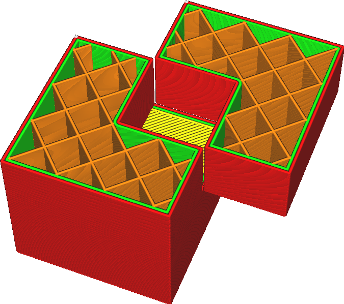

Joindre les volumes se chevauchant
====
Si un modèle contient plusieurs volumes qui se croisent, le volume qui se trouve à l'intérieur des deux volumes ne sera normalement pas rempli. Ce réglage fait que Cura ignore les structures internes et se contente de les remplir toutes, quel que soit le nombre de coquilles autour du volume.

En termes techniques, ce réglage modifie effectivement la règle des [Pairs/Impairs](https://en.wikipedia.org/wiki/Even%E2%80%93odd_rule) à [Non-zéro](https://en.wikipedia.org/wiki/Nonzero-rule). Normalement, un volume est rempli s'il est entouré d'un nombre impair de coques. Lorsque ce paramètre est activé, il est rempli s'il est entouré d'un nombre non nul de coques.

*Cela ne fonctionne que pour les volumes du même modèle. Si vous avez chargé plusieurs fichiers et les avez fait se croiser dans Cura, ce paramètre n'aura aucun effet. Voir le paramètre Supprimer l'intersection des mailles pour résoudre les problèmes de chevauchement de plusieurs mailles séparées.*
