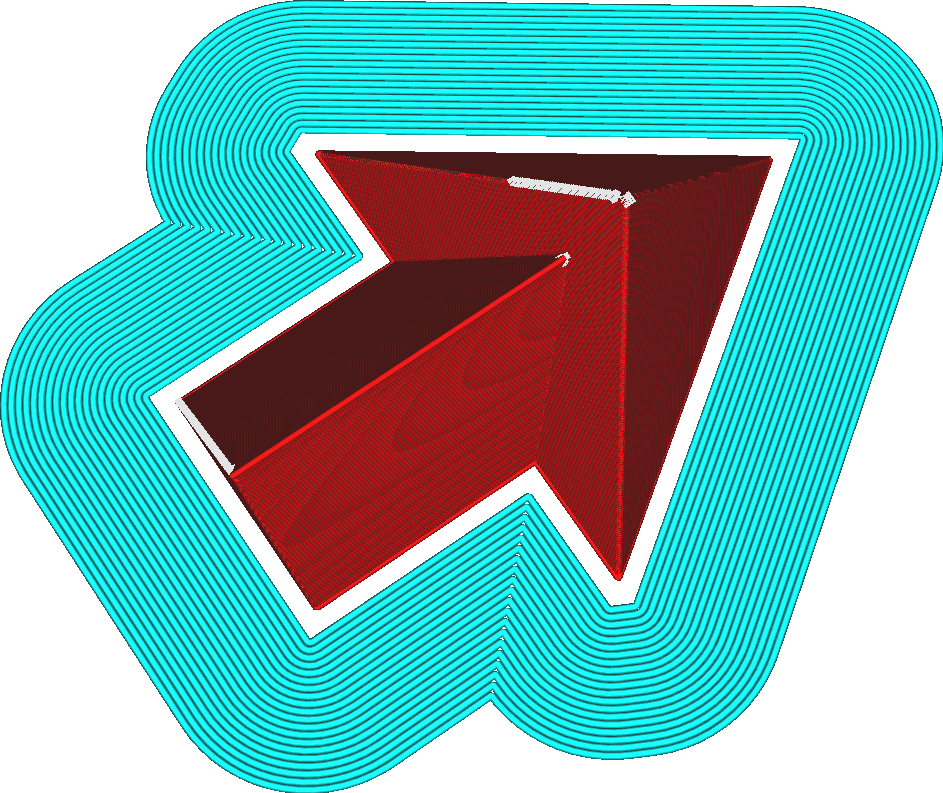

Espace de bordure
====
Ce réglage fait apparaître un décalage entre le modèle et le bord. Les lignes de bordure ne sont plus connectées au modèle.

L'objectif de cette écart est de faciliter le retrait du bord du modèle. En plaçant les lignes du bord légèrement à l'écart du modèle réel (de l'ordre d'une demi-ligne), la connexion entre le bord et le modèle devient plus faible qu'une couche, ce qui permet d'arracher le bord à la main. Cela permet également de réduire la cicatrice ou la patte d'éléphant laissée par le bord après son enlèvement. Cette méthode est particulièrement efficace lorsque la [hauteur de la couche initiale](../resolution/layer_height_0.md) est plus grande, car le bord épais a tendance à être plus difficile à enlever à ce moment-là.

En revanche, cela réduit également l'efficacité du bord pour maintenir le modèle collé au plateau d'impression. Avec une zone de contact plus fine, le bord ne pourra pas exercer beaucoup de force sur le modèle pour le maintenir contre les effets du [décollement](../troubleshooting/warping.md).
