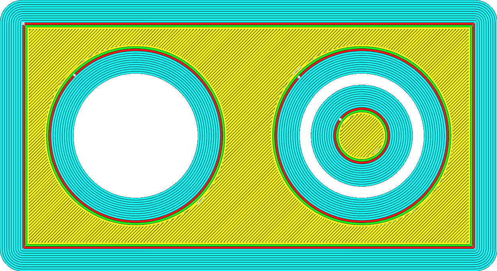
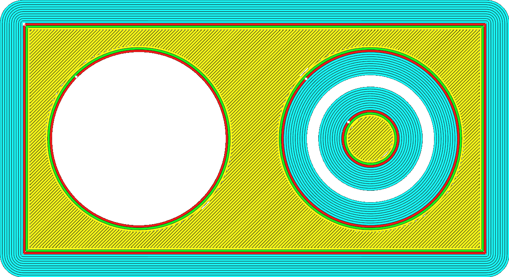

Si votre modèle comporte des trous dans la couche initiale de la plaque de construction, ce réglage empêchera l'impression d'un bord le long de l'intérieur du trou.

Le bord intérieur n'ajoute généralement que très peu de force d'adhérence supplémentaire entre l'impression et la plaque de montage et n'a aucun effet sur la prévention du rétrécissement. Le retrait du bord intérieur peut vous faire gagner du temps une fois l'impression terminée, car vous n'aurez pas besoin de retirer le bord des trous intérieurs.

**S'il y a un autre objet à l'intérieur du trou, le bord ne peut pas être enlevé en raison de limitations techniques.
