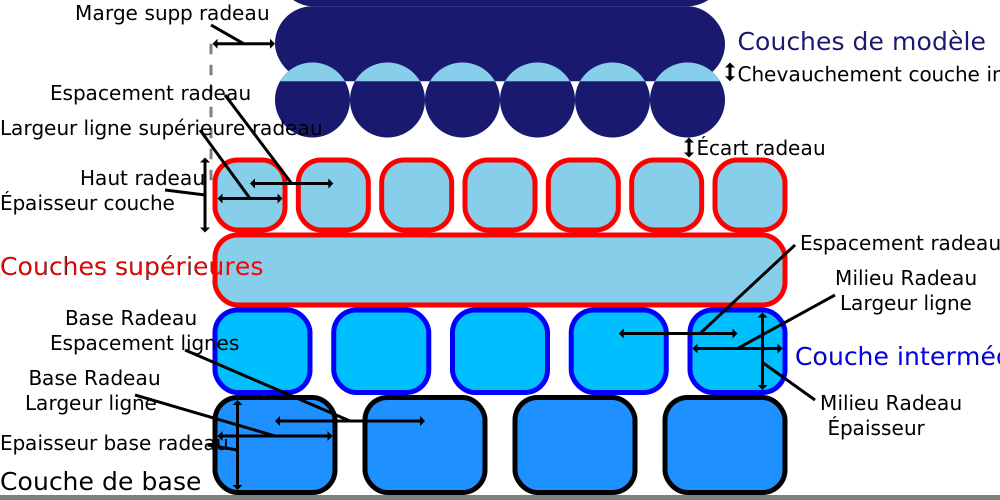

Largeur de la ligne de base du radeau
====
Ce paramètre configure la largeur des lignes avec lesquelles la couche la plus basse du radeau est dessinée.

Les lignes de la couche de base du radeau doivent être très épaisses. Des lignes plus épaisses feront que le matériau sera poussé très fort sur la plaque de construction, ce qui améliorera l'adhérence. Les lignes peuvent être un peu plus larges que la taille des buses, mais il y a une limite à la distance sur laquelle le matériau peut s'écouler latéralement avec de petites buses.
