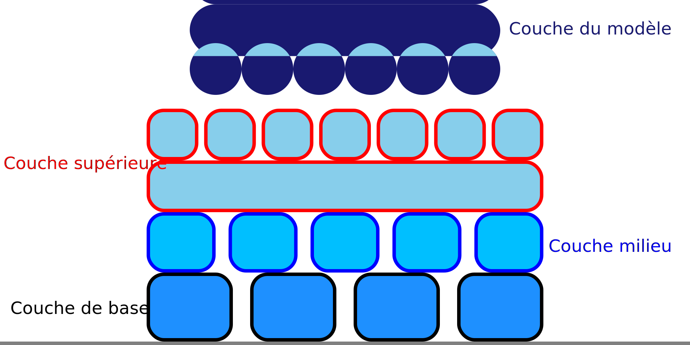

Extrudeur du milieu du radeau
====
Ce paramètre permet de sélectionner l'extrudeuse à utiliser pour les couches intermédiaires du radeau.

Les couches d'interface sont imbriquées entre la couche de base et les couches supérieures. Elles fonctionnent comme une zone tampon pour éloigner la chaleur du plateau d'impression des couches supérieures, pour fournir une certaine résistance structurelle et pour soutenir les couches supérieures mieux que ne le ferait la couche de base. Il est donc important de choisir un matériau qui adhère bien aux matériaux des couches de base et supérieure.
