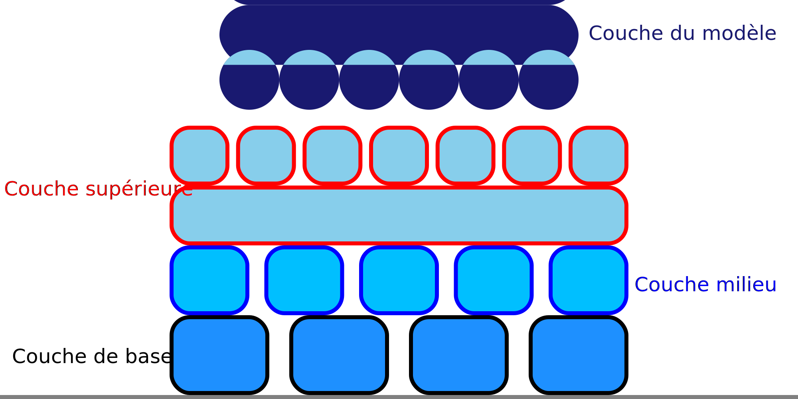

Vitesse d’impression du milieu du radeau
====
Ce paramètre permet de configurer la vitesse d'impression de la couche intermédiaire du radeau. La vitesse de la couche intermédiaire peut être configurée séparément de la vitesse des couches supérieure et inférieure.

L'impression plus lente de la couche intermédiaire maintient le matériau chaud plus longtemps, ce qui réduit les contraintes internes. Cela réduit le gauchissement une fois que le matériau a refroidi. Cependant, l'impression plus lente prend également plus de temps.
