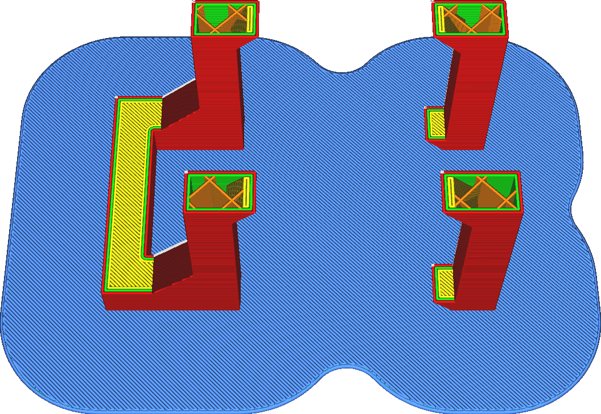

Lissage de radeau
====
Ce réglage permet de rendre les angles intérieurs du radeau plus lisses. Le réglage spécifie le rayon d'un arc. Tous les coins intérieurs qui sont plus nets que le rayon d'arc spécifié seront lissés pour avoir le rayon d'arc.

Le terme technique pour cela est une [opération de fermeture morphologique](https://en.wikipedia.org/wiki/Closing_\(morphology\)). Tous les trous plus petits que le rayon spécifié seront fermés. Les angles intérieurs les plus aigus ne seront plus aussi nets.

La fonction de ce réglage est de rendre le radeau plus rigide. Lorsque plusieurs pièces sont reliées par des raccords fins, le radeau peut se plier à ces endroits. Cela les rend moins rigides et moins résistants au gauchissement. En augmentant ce réglage, les pièces séparées seront mieux connectées, ce qui rendra le radeau plus solide. La surface du radeau sera plus grande, donc le radeau collera mieux. De plus, le radeau aura une circonférence totale plus petite, ce qui réduira les endroits où le gauchissement peut commencer. Au total, il devrait y avoir moins de déformation.

Cependant, le volume total du radeau sera également augmenté. Cela utilise plus de matériel et prend plus de temps à imprimer, d'autant plus que le radeau est normalement imprimé très lentement.
