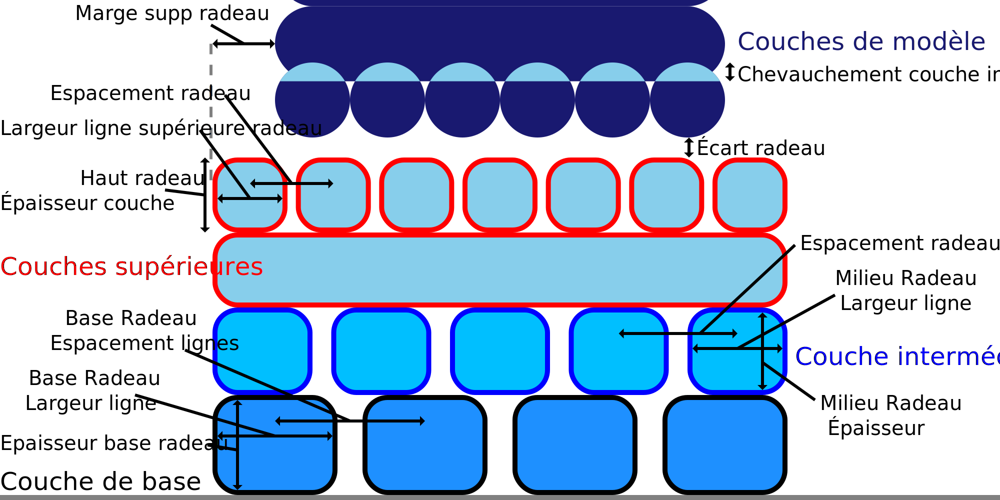

Épaisseur de la couche supérieure du radeau
===

Ce réglage permet d'ajuster l'épaisseur des couches de surface. Il ne s'agit que de la hauteur d'une couche, donc la hauteur totale des couches de surface correspondra à ce paramètre multiplié par la valeur du paramètre [Couches supérieures du radeau](raft_surface_layers.md).

Une faible hauteur de couche tend à améliorer l'effet de refroidissement sur le radeau. Cela améliore le surplomb et, par conséquent, la douceur du radeau. Un radeau plus lisse rend l'empreinte sur le dessus plus lisse également et améliore l'adhérence entre le radeau et l'objet. Cependant, une couche trop peu profonde provoque une sous-extrusion, ce qui n'est pas bénéfique pour l'adhérence. Il faut également tenir compte du fait qu'il y aura un grand changement de débit entre la couche supérieure du radeau et la couche inférieure de l'objet, ce qui entraînera une certaine sous-extrusion lors de l'impression de la première couche de l'objet.
