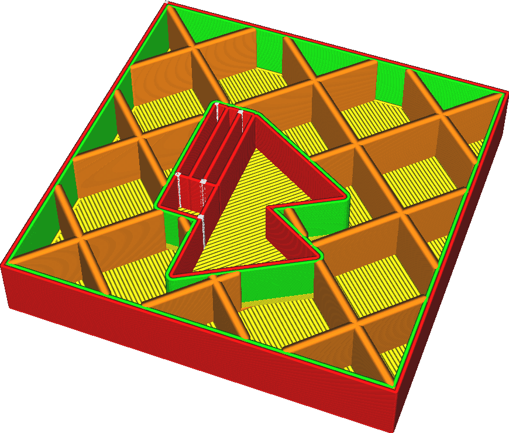

La largeur de chaque ligne de remplissage qui est tracée. La largeur d'une ligne peut être différente de la taille de la buse simplement en extrudant plus ou moins de matière que nécessaire. Si plus de matière est extrudée, le plastique s'écoulera vers les côtés, ce qui rendra la ligne plus épaisse. Si moins de matière est extrudée, la tension superficielle de la matière tend à tirer la matière vers la ligne centrale de la trajectoire de la buse.

En élargissant les lignes de remplissage, vous pouvez rendre votre impression plus solide et réduire le temps d'impression également. Cependant, en l'augmentant trop, vous risquez de provoquer de grandes fluctuations d'extrusion. Cela entraînera une sous-extrusion lors de l'impression du remplissage et une surextrusion lors de l'impression de ce qui vient après le remplissage, car le débit à travers la buse ne peut pas s'ajuster assez rapidement.

**Les lignes de remplissage peuvent être plus larges que ce qui est indiqué dans ce paramètre, si vous avez ajusté le paramètre [Infill Layer Thickness](../infill/infill_sparse_thickness.md).**
