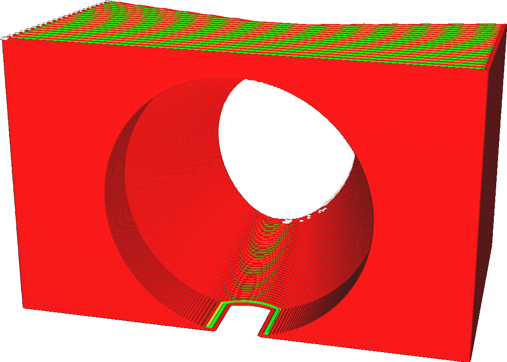
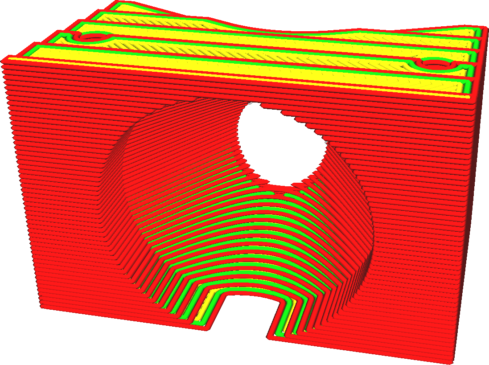

L'imprimante 3D dépose le plastique par couches. La hauteur des couches est l'épaisseur de ces couches en millimètres. C'est le facteur le plus important tant pour la qualité visuelle de votre impression finale que pour le temps d'impression.

La hauteur de la couche est le paramètre le plus important pour affecter la qualité globale et, inversement, le temps d'impression. Ce ne sont là que quelques-uns des effets :
* Le fait d'avoir des couches plus fines augmente la qualité visuelle de l'impression. Comme les couches sont plus fines, l'effet de marche d'escalier aux bords de la couche sera réduit. De plus, les couches seront plus proches les unes des autres et les plis entre les couches seront donc plus petits, ce qui donnera une finition plus lisse dans l'ensemble.
* Le fait d'avoir des couches plus fines permet à l'imprimeur de produire plus de détails sur les côtés supérieur et inférieur de votre impression.
* Le fait d'avoir des couches plus épaisses tend à rendre l'impression plus forte, jusqu'à un certain point. Il y aura moins de bordures entre les couches, ce qui constitue un point faible. Les couches plus épaisses ne se cisailleront pas autant.
* Les couches plus épaisses réduisent le temps d'impression, car la buse n'a pas besoin de faire autant de mouvements horizontaux.

Hauteur des couches par rapport aux profils
----
De nombreux paramètres dépendent de la hauteur de la couche. Comme la hauteur de la couche affecte considérablement le débit du matériau à travers la buse, de nombreux paramètres du processus d'impression vont changer. Ceci est très complexe. Par exemple, lorsque vous augmentez la hauteur de la couche, vous devez probablement augmenter légèrement la température d'impression pour compenser le taux supplémentaire de perte de chaleur. La température affecte alors la liquidité du matériau, ce qui aura une incidence sur la netteté de vos coins et sur le refroidissement nécessaire, etc. Il est toujours judicieux de partir d'un profil de qualité pré-établi, disponible pour votre imprimante, qui a une hauteur de couche proche de ce que vous souhaitez.

Vous pouvez choisir la hauteur de couche souhaitée en mode personnalisé, mais les profils préfabriqués sont également disponibles avec différentes hauteurs de couche. Vous pouvez choisir des profils pour différentes hauteurs de calque dans le mode recommandé à l'aide d'un curseur ou en utilisant le widget déroulant en mode personnalisé. Comme ces profils modifient également certains paramètres qui dépendent de la hauteur de la couche, vous obtiendrez probablement une meilleure qualité de cette façon.

Notes supplémentaires
----
A très faible hauteur de couche, vous pourriez vous heurter à la limite de résolution de votre axe Z. Vérifiez la taille du pas de l'axe Z de votre imprimante et assurez-vous que la hauteur de la couche est un multiple de celle-ci. Si elles ne correspondent pas, certaines couches seront plus épaisses que d'autres, ce qui entraînera des bandes.

*Notez que le réglage de la hauteur des calques ne s'applique pas au calque initial de l'impression ni aux calques du radeau, qui ont leurs propres réglages pour ajuster la hauteur des calques séparément. Lors de l'utilisation de couches adaptatives, ce paramètre de hauteur de couche sera utilisé comme ligne de base mais la hauteur de couche réelle aura une certaine variation.*

