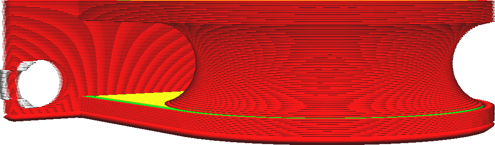

This setting defines the thickness of the first layer of your print. The initial layer is normally printed thicker than the rest in order to create a stronger adhesion with the build plate. With this setting, the initial layer's thickness can be increased without reducing the resolution of the rest of the print.

Increasing the initial layer's thickness causes the nozzle to extrude more material over the same distance. This takes extra force, as the material spreads out to the sides to fill the full line width. This extra force causes the material to stick better to the build plate. Additionally, the thicker layer will catch any irregularities in the flatness of the surface. If the build plate is slightly bent, the variability will be absorbed by the thickness of the first layer, whereas otherwise the nozzle could scrape it off in the second layer.

Having too thick of an initial layer causes the first layer to sag more, which causes elephant's feet. The [Initial Layer Horizontal Expansion](../shell/xy_offset_layer_0.md) setting can prevent this by giving it a small negative value.