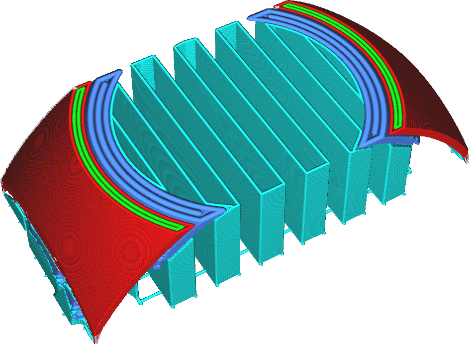

Largeur de ligne de plafond de support
===

La largeur des lignes de soutien du toit peut être configurée séparément de la largeur du reste des lignes de soutien.

L'impression du toit du support avec des lignes légèrement plus fines est souvent avantageuse pour la qualité de la surface en surplomb qu'il supporte, du seul fait qu'il a une surface supérieure plus lisse au-dessus de l'interface du support. Cependant, cela n'augmente pas nécessairement l'adhérence entre l'interface du support et le modèle, de sorte que le support ne sera pas nécessairement plus difficile à enlever.

Cependant, l'impression de lignes de toit trop fines entraînera une extrusion inégale, ce qui réduit l'effet de support du toit, entraînant une moins bonne qualité du porte-à-faux. Cela peut également introduire un grand changement dans le débit à travers la buse, provoquant une surextrusion lorsqu'elle commence à imprimer le toit de support et une sous-extrusion lorsqu'elle imprime ce qui vient après le toit de support.
