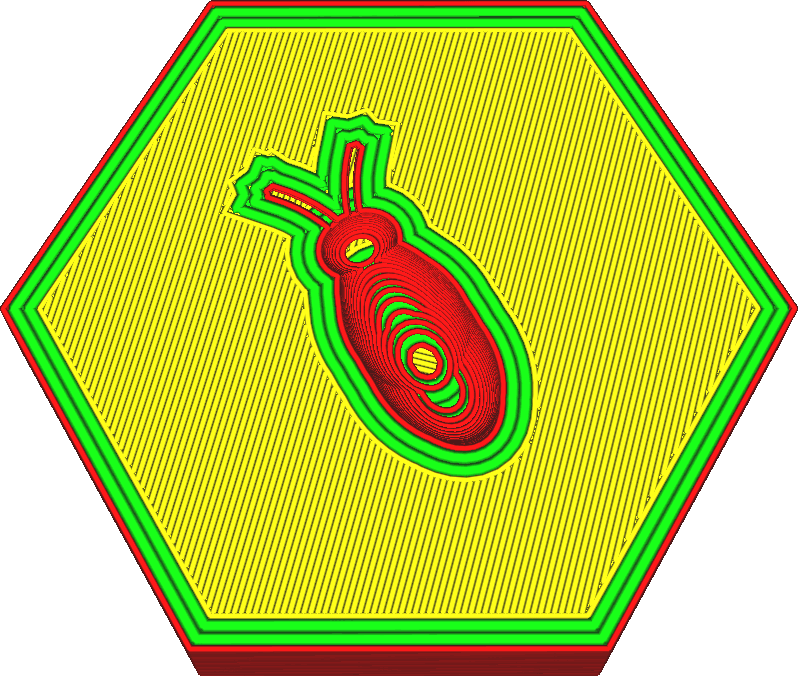

Largeur de ligne de la (des) paroi(s) interne(s)
===

La largeur de la ligne des parois intérieures peut être ajustée séparément de celle de la paroi extérieure. Ce réglage indique la largeur des lignes de chaque paroi intérieure.

La réduction des parois internes à une largeur de ligne légèrement inférieure à la taille de la buse est connue pour être bénéfique pour la résistance. La buse extrudera un peu moins de matière, mais son ouverture chevauchera les lignes des parois adjacentes. Le matériau est alors repoussé par la paroi précédemment placée à son emplacement correct. Mais cela permet également au plastique de mieux fusionner avec les parois adjacentes. Cela permet aux murs de mieux fusionner entre eux afin qu'ils puissent combiner leur force. Cela améliore considérablement la résistance des murs.

Augmenter la largeur de la ligne de la paroi intérieure peut réduire le temps d'impression. Vous aurez besoin de moins de parois intérieures pour obtenir des pièces de résistance similaire. La résistance sera tout de même quelque peu réduite car les parois adjacentes ne fusionneront pas autant entre elles.

Ajustement des lignes
----
Lors de l'impression de pièces fines, le réglage de la largeur des lignes de la paroi est un outil important pour obtenir des pièces précises et solides. Cura ne dessine jamais que des contours complets, donc si un contour n'est pas adapté, un espace va tomber dans les parois, ce qui compromet grandement la solidité et la précision de la pièce.

Cura tentera de combler ces vides entre les murs si [Remplir les trous entre les parois](../shell/fill_perimeter_gaps.md) est activé, mais cette technique est loin d'être idéale pour les formes arbitraires et prend souvent beaucoup de temps d'impression. Lorsque deux murs se chevauchent, la fonction [Compenser les chevauchements de paroi](../shell/travel_compensate_overlapping_walls_enabled.md) réduit la largeur de la ligne de mur pour s'assurer que la pièce est dimensionnellement précise, mais cela entraîne des changements de flux qui réduisent également la qualité et la résistance de l'impression.

Pour un ajustement idéal, il faut que la pièce soit un multiple exact de la largeur de la ligne de paroi afin que les parois s'adaptent précisément à la pièce. Si vous connaissez la largeur de votre pièce, cela peut facilement se faire en ajustant la largeur des parois. Vous voyez d'abord combien de contours vous voulez ajuster de manière à ce que les lignes aient encore une largeur raisonnable. Ensuite, vous pouvez voir de combien vous devez ajuster la largeur des lignes des murs pour que les lignes s'ajustent correctement. Gardez à l'esprit que vous pouvez ajuster la [Largeur de ligne de la paroi externe](wall_line_width_0.md) et la [Largeur de ligne de la (des) paroi(s) interne(s)](wall_line_width_x.md) séparément. Comptez soigneusement le nombre de fois que chaque type de mur sera dessiné pour prévoir l'effet de la modification de la largeur de la ligne de mur.

L'ajustement des lignes de mur est une compétence importante pour l'impression 3D qui distingue les opérateurs experts d'imprimantes 3D des autres. Une certaine pratique est nécessaire.

