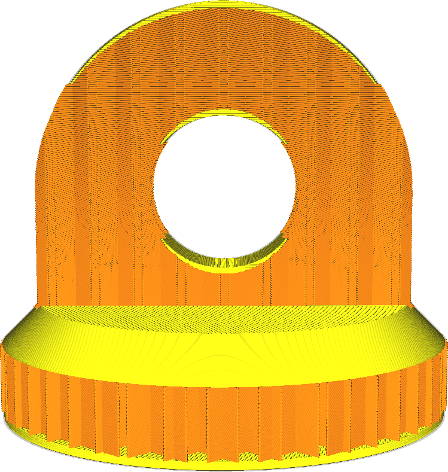
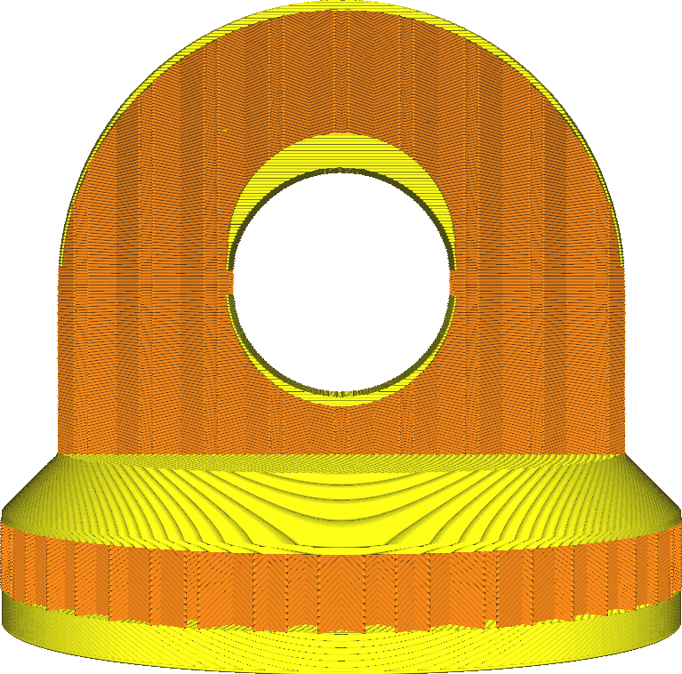

Couches inférieures
====
Avec ce paramètre, vous pouvez définir le nombre de couches inférieures solides de l'impression. Une valeur plus élevée garantit que tous les espaces sur les couches inférieures sont complètement fermés. Cependant, cela peut également augmenter le temps d'impression et la quantité de filament utilisée.

* Augmentez pour améliorer la force.
* Augmentez pour combler les espaces en bas de votre impression.
* Réduisez pour raccourcir le temps d'impression et l'utilisation de la matière.
