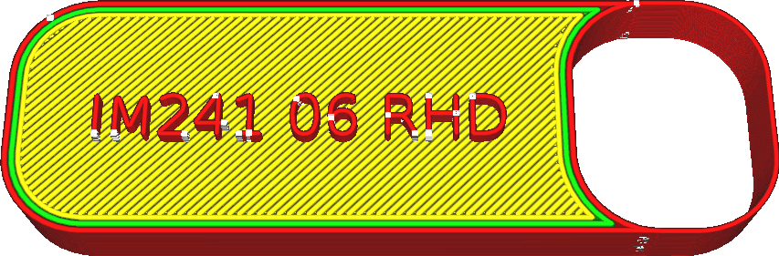

Imprimer parois fines
====
Normalement, Cura omet les parois plus minces que la [Largeur de ligne de la paroi externe](../resolution/wall_line_width_0.md), les rejetant comme étant trop petits pour être imprimés.

Si ce paramètre est activé, Cura essaiera quand même d'imprimer ces pièces. L'impression résultante sera imprécise et désordonnée, mais elle devrait produire la forme souhaitée de manière assez fiable.

Les minuscules morceaux sont remplis de lignes extrêmement fines. Ces lignes sont ensuite combinées si elles sont adjacentes les unes aux autres et pas trop longues. Cela fonctionne dans de nombreux cas, mais dans certains cas, cela produit un minuscule zigzag, ce qui augmente considérablement le temps d'impression.

Il est conseillé, avant de recourir à ce réglage, d'essayer d'ajuster légèrement la [largeur de ligne de la paroi externe](../resolution/wall_line_width_0.md). Si votre pièce est légèrement plus fine qu'une largeur de ligne, vous obtiendrez peut-être un meilleur résultat si vous réduisez la largeur de ligne de la paroi extérieure pour toute votre impression de manière à ce que les parties fines s'impriment normalement. Cependant, si vous réduisez trop la largeur de ligne, le matériau ne s'écoulera pas de manière fiable, ce qui entraînera une sous-extrusion.

**Cela ne permettra d'imprimer que les pièces fines dans le plan horizontal. Pour les pièces minces dans la direction Z, voir le réglage [Tolérance à la découpe](../experimental/slicing_tolerance.md) ou augmenter la hauteur de la couche.**
