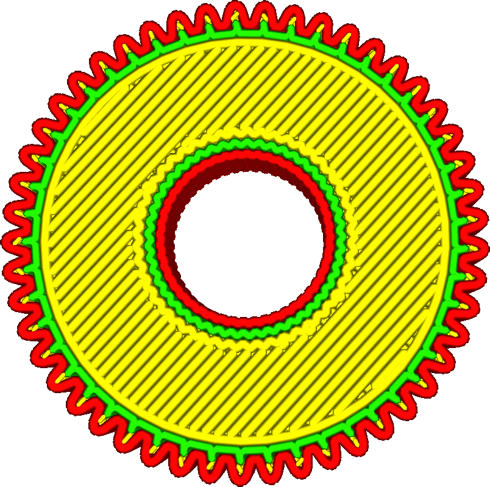
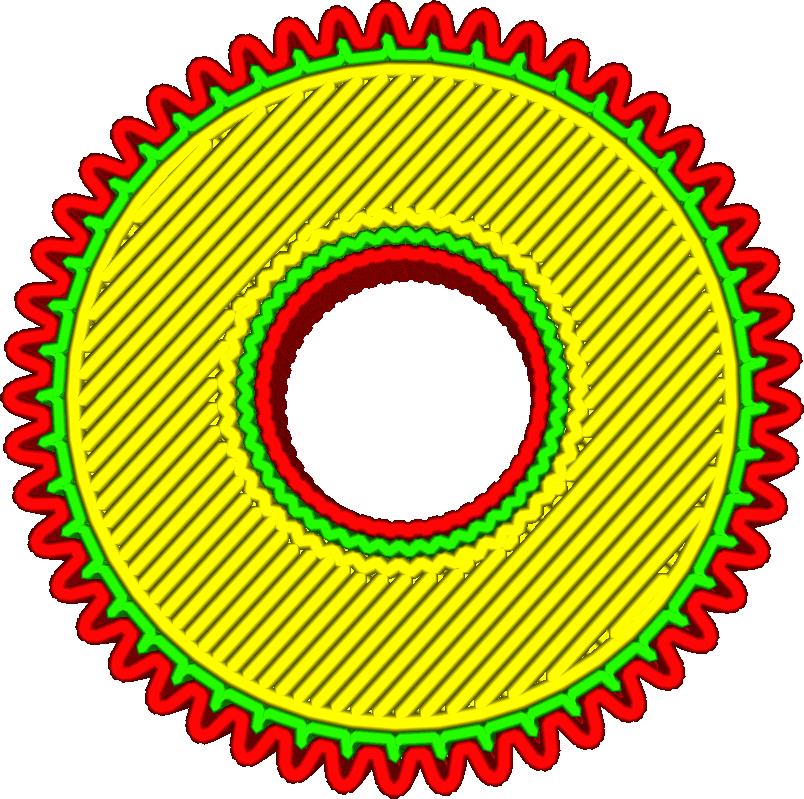

Filtrer les très petits trous
====
Le remplissage des espaces entre les murs introduit des déplacements supplémentaires. Si les espaces sont extrêmement petits, le matériau n'aura généralement pas assez de temps pour s'écouler très bien de la buse. Si ce paramètre est activé, l'imprimante ne prendra pas la peine de remplir certains des plus petits espaces.

Les espaces inférieurs à deux lignes carrées de largeur de paroi extérieure comptent comme des espaces "minuscules". Par exemple, si votre paramètre [Largeur de ligne de la paroi externe](../resolution/wall_line_width_0.md) est réglé sur 0,4 mm, les espaces ayant une surface de 0,4 mm * 0,4 mm * 2 = 0,32 mm^2 ne seront plus remplis.
