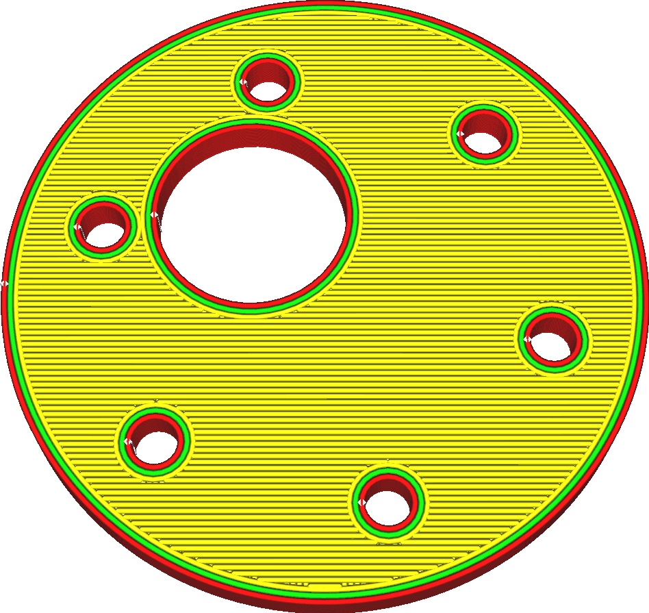
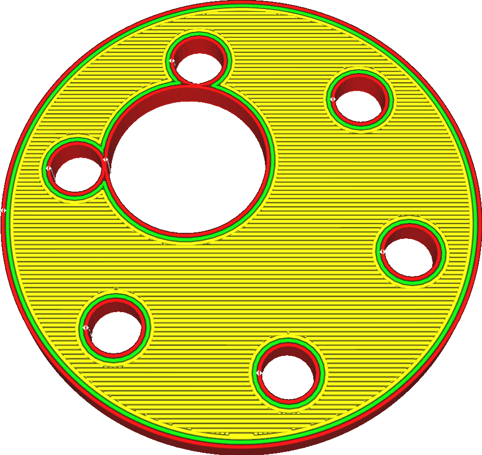

Expansion horizontale des trous
====
Il s'agit d'une mesure de compensation dans le cas où les trous ont tendance à être imprimés plus petits que prévu. Grâce à ce paramètre, vous pouvez augmenter la taille des trous verticaux de votre impression. Comme pour le réglage de base [Expansion horizontale](xy_offset.md), les trous de votre impression seront agrandis dans toutes les directions.

Comme le trou est élargi dans toutes les directions, la valeur de ce paramètre s'applique effectivement au rayon des trous, et non à leur diamètre.

En raison de la viscosité du matériau, lorsque vous imprimez une ligne de plastique dans une courbe, le plastique a tendance à être entraîné avec la buse dans la courbe. Cela rend la courbe légèrement plus petite que prévu, car le fil est tirée à l'intérieur de la courbe. Normalement, cela n'est pas vraiment visible, mais lorsque vous imprimez des pièces qui doivent s'ajuster très exactement ou lorsque vous imprimez des articles avec de très petits trous verticaux, cela devient préjudiciable pour la précision de votre impression. Les vis ne s'adaptent plus, les pièces ne s'emboîtent plus parfaitement les unes dans les autres, et ainsi de suite.

Ce réglage compense cela en agrandissant légèrement tous les trous. Contrairement à [Expansion horizontale](xy_offset.md), ce réglage n'affecte que les trous fermés. S'il y a ne serait-ce qu'une petite ouverture sur un côté (horizontalement, sur la même couche), alors cette partie ne sera pas considérée comme un trou et ne sera pas affectée par ce paramètre.

Une valeur positive rendra les trous plus grands. Une valeur négative rendra les trous plus petits. Lorsqu'il est combiné avec l'expansion horizontale, les trous sont d'abord agrandis avant d'appliquer l'expansion horizontale ordinaire. Cela peut entraîner la disparition totale des pièces fines avant qu'elles ne soient agrandies par l'expansion horizontale ordinaire.

Notez que ce paramètre ne prend en compte que les trous dans le plan des couches. Il ne règle la taille des trous que sur le haut ou le bas de l'impression. Les trous situés sur les côtés de l'impression ne sont pas ajustés. De plus, il n'y a aucune restriction sur la taille ou la forme du trou. Toute cavité qui est complètement entourée de matériau sur cette couche sera expansée, même l'intérieur d'une impression creuse. En outre, cela signifie que dès qu'il y a une ouverture sur le côté d'une telle forme, l'intérieur n'est plus complètement entouré de ces couches et ne se dilatera donc pas. Il en résulte souvent une arête visible à l'intérieur de l'impression, exactement à la hauteur d'une ouverture sur le côté, où l'intérieur n'est momentanément pas dilaté en raison de cette ouverture.
