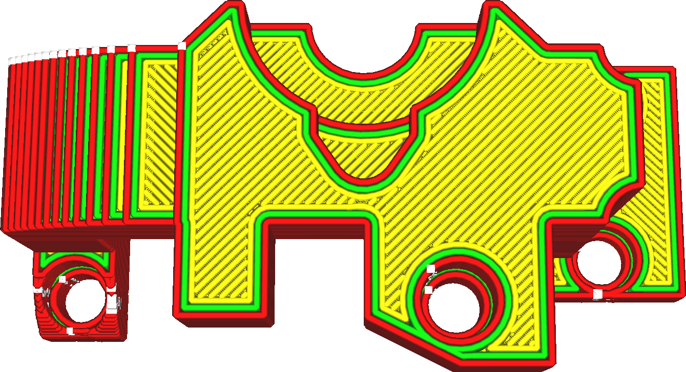

Normalement, l'étirage n'est pas lisse jusqu'au bord extérieur. Si c'était le cas, la pression continue dans la chambre de la buse ferait passer le matériau par-dessus le bord, ce qui provoquerait une sorte d'effet d'ondulation. Ce réglage détermine la distance du repassage par rapport au bord.

Il y a deux principaux cas d'utilisation pour ce cadre :
* Pour s'assurer que le matériau ne se dépose pas par-dessus le bord.
* Pour filtrer les bandes fines qui seraient normalement repassées. Si vous avez une pente peu profonde, vous ne voudrez peut-être pas que chaque couche de cette pente soit repassée. En augmentant ce réglage, vous pouvez filtrer les bandes les plus fines, mais les parties les plus grandes ne seront pas repassés jusqu'au bord.
