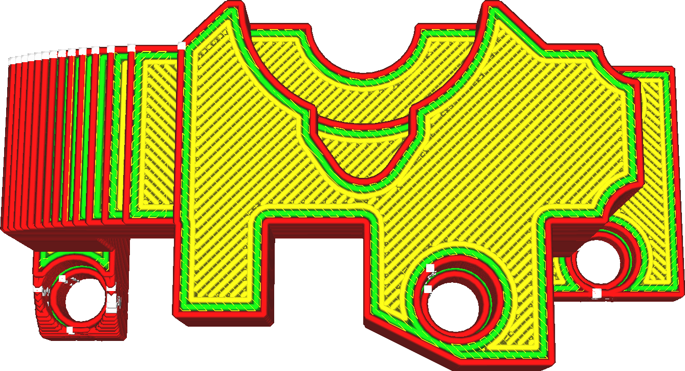

Interligne de l'étirage
===
Ce réglage modifie l'espace entre chaque ligne de repassage. Les lignes de repassage sont normalement beaucoup plus rapprochées que les lignes d'impression proprement dites, ce qui contribue grandement à son efficacité.

* L'augmentation de l'interligne permettra de réduire le temps d'impression.
* Toutefois, la réduction de l'interligne améliorera la qualité de la surface supérieure.
