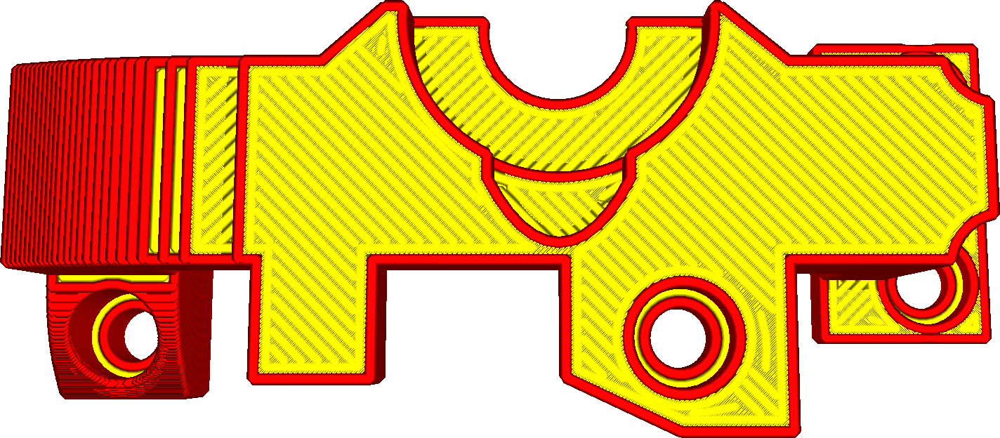
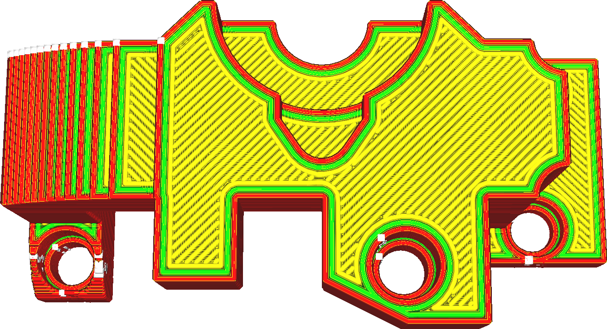

Motif d'étirage
===

L'étirage recouvre la surface supérieure avec un motif de cheminement. Ce réglage détermine le motif utilisé pour le repassage de la surface supérieure.

L'objectif du motif est de créer une surface lisse et continue. S'il y a une interruption dans le motif, cela créera une bordure visible sur la surface supérieure. Deux motifs sont disponibles.

Zigzag
----

La buse fera ainsi des allers-retours sur la surface. Elle fonctionne bien et de manière fiable pour la plupart des surfaces, mais elle causera un peu plus de bordures que nécessaire.

Concentrique
----

La buse tournera alors en rond de l'intérieur vers l'extérieur. Les bords seront ainsi réduits au minimum, mais si les anneaux concentriques deviennent très petits au centre, la matière se dégradera parce que la buse restera trop longtemps au même endroit. Cela laisse une tache visible sur la surface. Par conséquent, cette méthode est plus efficace pour les surfaces longues et minces que pour les surfaces aussi larges que hautes.
