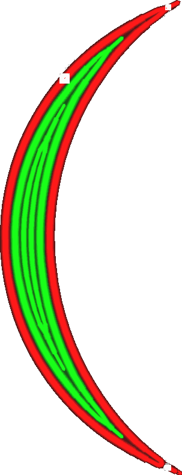
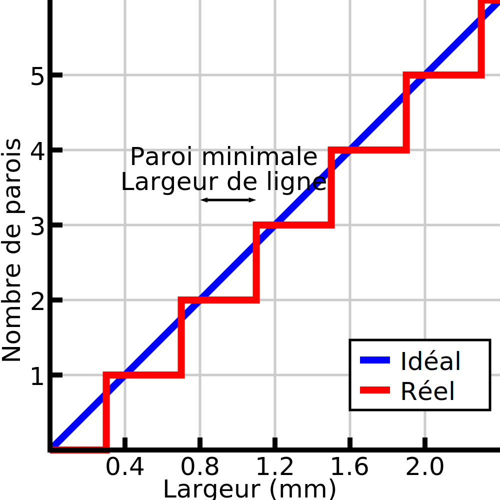

Largeur minimale de la ligne de paroi
====
Lors de l'impression de pièces fines, Cura ajuste la largeur des lignes de parois pour s'adapter à la largeur exacte du modèle. Cura peut également décider d'utiliser moins de lignes de parois à la place. Ce paramètre détermine le seuil à partir duquel Cura décide de supprimer une paroi au lieu de rendre les parois existantes plus fines.

<!--screenshot {
"image_path": "min_wall_line_width_0_34.png",
"models": [{"script": "moon_sickle.scad"}],
"camera_position": [0, 0, 63],
"settings": {
	"min_wall_line_width": 0.34,
	"wall_line_count": 3,
	"wall_transition_angle": 20
},
"layer": 14,
"colours": 32
}-->
<!--screenshot {
"image_path": "min_wall_line_width_0_1.png",
"models": [{"script": "moon_sickle.scad"}],
"camera_position": [0, 0, 63],
"settings": {
	"min_wall_line_width": 0.1,
	"wall_line_count": 3,
	"wall_transition_angle": 20
},
"layer": 14,
"colours": 32
}-->

Différents nombres de cordons
----
S'il y a une seule ligne centrale et que le [Nombre de distributions des parois](wall_distribution_count.md) est réglé sur 1, ce paramètre fonctionne exactement comme il le dit. Si la ligne centrale devient plus fine qu'une certaine largeur, elle est supprimée au profit de l'élargissement d'autres lignes. Dans les autres cas, le calcul est plus complexe.

Le calcul précis de cette valeur est complexe, mais une compréhension intuitive peut être utile. En fait, vous pouvez simplement diviser la largeur totale du modèle par la [largeur de ligne ordinaire](../resolution/wall_line_width.md) pour obtenir un certain nombre de cordons. Il peut s'agir d'une fraction (par exemple, 5,3 largeurs de ligne de paroi). La largeur minimale de ligne de paroi prend juste cette fraction (0,3 largeur de ligne) et ajoute un cordon supplémentaire s'il dépasse la largeur minimale de ligne de paroi. Le nombre de cordons étant connu, il détermine ensuite la largeur de chacune des lignes en fonction du compte de distribution des cordons.

En fait, cela signifie que si plusieurs lignes voient leur largeur ajustée, la largeur de la ligne ne sera jamais aussi extrême que la largeur minimale de la ligne de paroi le permettrait. Par exemple, si les deux lignes du milieu sont ajustées, la largeur de la ligne ne tombera pas en dessous de la moyenne de la largeur normale de la ligne et de la largeur minimale de la ligne de paroi.

Ce paramètre peut être réglé séparément pour un nombre de parois [paire](min_even_wall_line_width.md) et [impaire](min_odd_wall_line_width.md). Le fait de n'avoir aucun cordon est également un cas distinct, qui peut être réglé à l'aide du paramètre [Taille minimale des entités](min_feature_size.md).

Réglage
----
En théorie, en fixant cette valeur à 50 % de la largeur de ligne, on s'assure que la largeur de ligne reste la plus proche de la largeur de ligne ordinaire. Cependant, il est préférable de rester un peu au-dessus de cette valeur. Il est plus facile pour une imprimante d'imprimer des lignes plus larges que la taille de la buse que d'imprimer des lignes plus fines, et avoir moins de lignes signifie également que l'impression sera plus rapide.

Avec des matériaux très visqueux ou lors d'une impression plus rapide, la largeur minimale de la ligne de paroi doit être réduite pour éviter de créer des lignes trop larges. Celles-ci sont difficiles à imprimer si le matériau n'a pas le temps de s'écouler suffisamment sur les côtés. Si la largeur minimale de ligne de paroi est trop élevée, les parois ne collent pas bien ensemble, ce qui rend l'impression fragile.

**Ce paramètre ne s'applique pas seulement aux parois normales, mais aussi aux parois à contour supplémentaire, aux parois de soutien, aux parois de remplissage et aux motifs concentriques.**