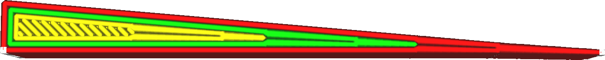
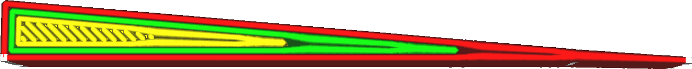

Longueur de Transition des murs
====
Dans les pièces minces, toutes les parois ne rentrent pas à l'intérieur de la forme. Si la pièce est plus fine à certains endroits qu'à d'autres, Cura doit utiliser un nombre différent de parois à certains endroits. Ce paramètre contrôle la largeur de la zone de transition où l'on ajoute ou supprime l'une des parois.

<!--screenshot {
"image_path": "wall_transition_length_0_2.png",
"models": [{"script": "wedge.scad"}],
"camera_position": [-7, 0, 75],
"settings": {"wall_transition_length": 0.2},
"colours": 64
}-->
<!--screenshot {
"image_path": "wall_transition_length_1_5.png",
"models": [{"script": "wedge.scad"}],
"camera_position": [-7, 0, 75],
"settings": {"wall_transition_length": 1.5},
"colours": 64
}-->

La zone de transition entre différents nombres de murs présente toujours de légers problèmes. C'est le plus visible lorsqu'une seule ligne au centre se termine et que les deux murs environnants doivent combler le vide. Ils ne remplissent pas immédiatement l'espace, et un vide est laissé. Cela se traduit par de petits trous en haut et en bas des impressions. Le contraire se produit lorsque deux murs se combinent en un seul, ce qui les fait se chevaucher pendant un moment jusqu'à ce qu'ils se rejoignent. La surextrusion peut entraîner une imprécision dimensionnelle, surtout lorsqu'elle se produit dans la paroi extérieure. Tout cela peut être évité en rendant la transition aussi courte que possible.

Toutefois, une transition courte oblige également la buse à effectuer des virages très serrés pour combler rapidement cet espace. Il en résulte une augmentation du tintement, en particulier si cela se produit pour l'impression de la paroi extérieure. Si la transition est plus longue, les accélérations dans la buse sont réduites, en particulier si elles sont inférieures à la limite [Saccade](../speed/jerk_print.md).

Fixer cette longueur à une ou deux fois la largeur de la ligne est un point de départ raisonnable. Les imprimantes dont les cadres sont plus faibles ou les têtes d'impression plus lourdes peuvent avoir besoin de l'augmenter, tandis que les imprimantes qui peuvent accélérer rapidement sans sonner peuvent se contenter de raccourcir la transition pour améliorer la qualité visuelle.

**Ce paramètre ne s'applique pas seulement aux murs normaux, mais aussi aux murs à peau supplémentaire, aux murs de soutien, aux murs de remplissage et aux motifs concentriques.**