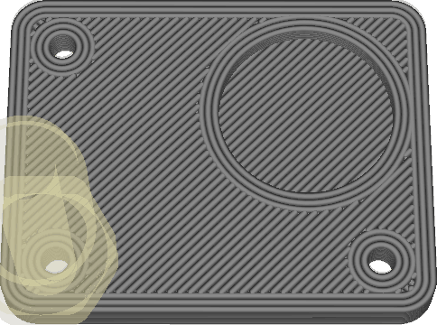
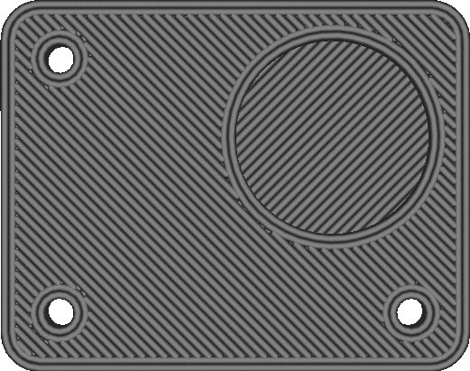

Optimiser l'ordre d'impression des parois
===

Si cette fonction est activée, Cura consacrera un temps de découpe supplémentaire pour optimiser l'ordre dans lequel les murs sont imprimés. L'objectif est de réduire le nombre de déplacements et de retraits en imprimant les murs qui entourent la même pièce les uns après les autres.

Si cette optimisation est activée, la buse imprimera d'abord toutes les parois autour d'une pièce avant de passer à la pièce suivante, au lieu d'imprimer d'abord toutes les parois intérieures avant d'imprimer les parois extérieures. L'optimisation est généralement positive, mais pour certaines pièces, elle peut avoir un impact sur la précision dimensionnelle car la paroi précédente ne s'est pas encore solidifiée lors du placement de la suivante à côté d'elle.
