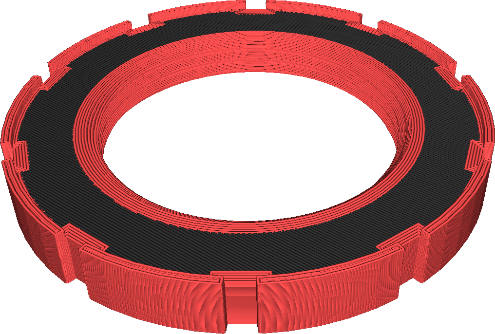

Pour les imprimeurs qui disposent de plusieurs extrudeuses, cela permet de sélectionner l'extrudeuse qui sera utilisée pour imprimer la surface supérieure.

Ainsi, vous pouvez donner à la surface supérieure une couleur ou un matériau différent. N'oubliez pas que l'extrudeuse des parois n'est pas réglée par ce réglage, de sorte qu'il y aura toujours un rebord autour de la surface supérieure.

Outre le fait de donner à la surface supérieure une couleur différente, vous pouvez également l'utiliser pour imprimer la surface supérieure avec un matériau différent. Cela peut donner divers effets :
* Imprimez la surface supérieure et la paroi extérieure en PLA tout en imprimant le reste avec un matériau plus rigide pour obtenir un objet solide qui a également un bel aspect.
* Imprimer la surface supérieure avec du TPU mais le reste avec un matériau plus dur pour obtenir une surface de préhension douce et à haut frottement.
* Imprimez la surface supérieure avec un matériau plus glissant que le matériau plus résistant dont vous avez besoin pour l'intérieur du modèle, si quelque chose doit glisser sur la surface.

**Si le matériau de la surface supérieure n'adhère pas bien au matériau inférieur, il a tendance à se détacher après l'impression. Soyez particulièrement prudent avec les matériaux ayant un taux de rétrécissement élevé.**
