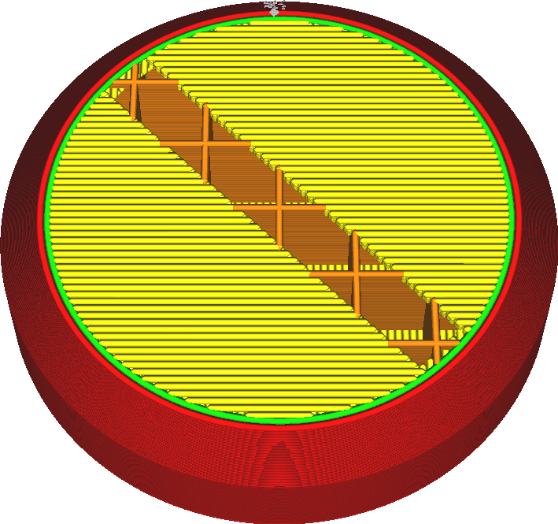

Nombre supplémentaire de parois extérieures
====
En imprimant le haut et le bas avec le motif des lignes, le bord extérieur des zones de la peau peut encore être imprimé avec quelques lignes concentriques. Cette méthode diffère de l'impression d'une paroi supplémentaire, car la paroi de peau supplémentaire est également placée entre la peau et le remplissage.

Normalement, les lignes de la peau peuvent se terminer à l'intérieur de la garniture clairsemée. Leurs extrémités s'affaissent alors un peu. S'il y a des parois de peau supplémentaires, l'imprimante imprimera d'abord un périmètre autour de la peau auquel les lignes de peau normales peuvent s'attacher. La peau ne s'affaissera alors pas autant dans les points d'extrémité. Au final, cela tend à améliorer un peu la qualité des surfaces supérieures.
