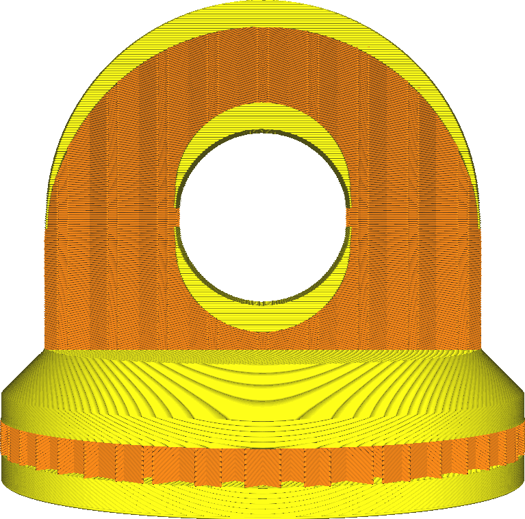

Avec l'épaisseur supérieure/inférieure, vous pouvez ajuster l'épaisseur de la peau solide créée sur les côtés supérieur et inférieur de votre impression.

Cela concerne à la fois les faces supérieure et inférieure de l'impression. Le haut et le bas peuvent également être configurés individuellement avec les paramètres [Épaisseur du dessus](./top_thickness.md) et [Épaisseur du dessous](./bottom_thickness.md).

Si ce paramètre n'est pas un multiple de la hauteur de la couche, il sera arrondi au multiple le plus proche. Ce paramètre détermine uniquement le nombre de couches supérieures et inférieures qui seront générées.

Une épaisseur supérieure et inférieure plus importante aura plusieurs effets, bénéfiques pour la qualité totale mais préjudiciables à la productivité.
* Votre pièce sera plus solide. Une épaisseur supérieure et inférieure plus importante signifie qu'une partie plus petite de votre impression sera remplie par le motif de remplissage épars. Au lieu de cela, elle sera rendue complètement solide.
* La surface supérieure sera plus lisse. Les coussins et les affaissements de la peau supérieure seront aplanis dans les couches du dessus.
* Il est plus probable que votre modèle soit étanche. Sur les côtés supérieur et inférieur, il y aura plus de couches pour empêcher l'eau ou d'autres fluides de pénétrer et pour récupérer les surplombs affaissés.
* Votre empreinte utilisera plus de matériel, car plus de couches sont remplies complètement.
* Votre tirage prendra plus de temps, car il faudra déposer plus de matériau et ces couches sont normalement imprimées plus lentement que le remplissage.
