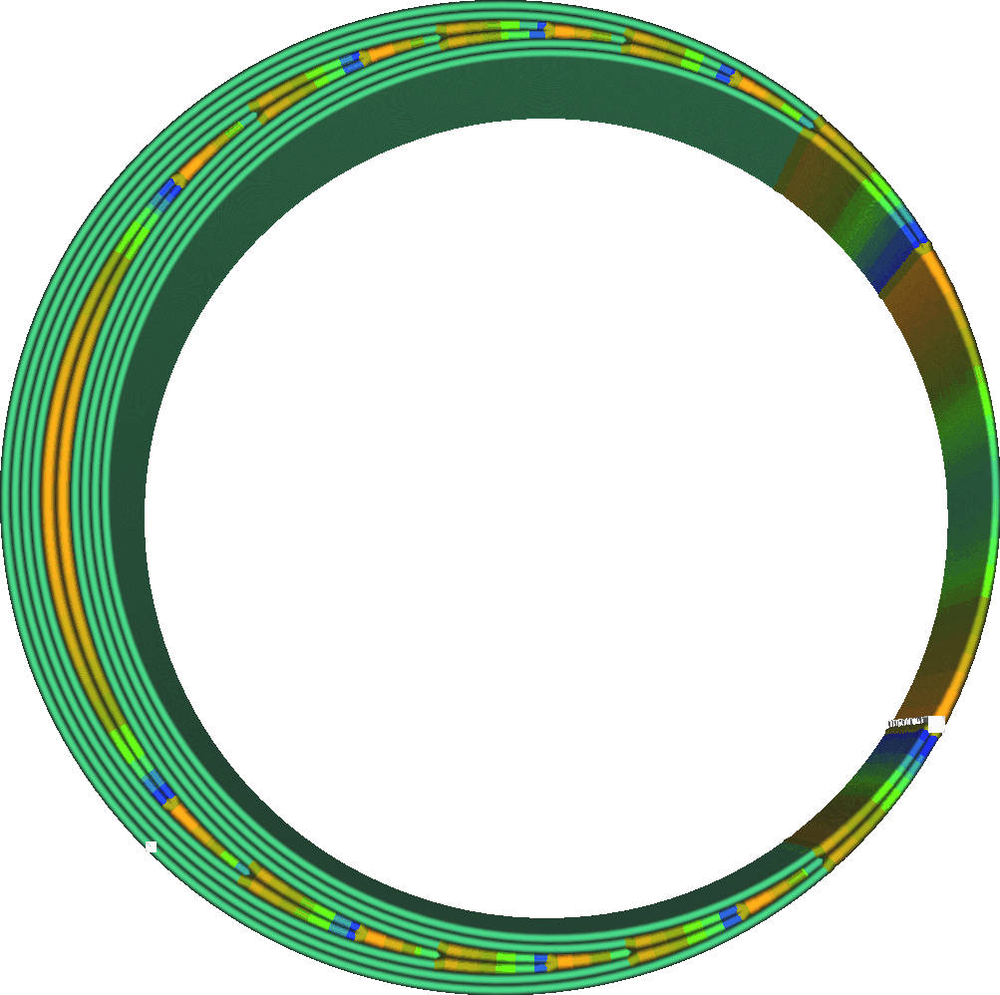
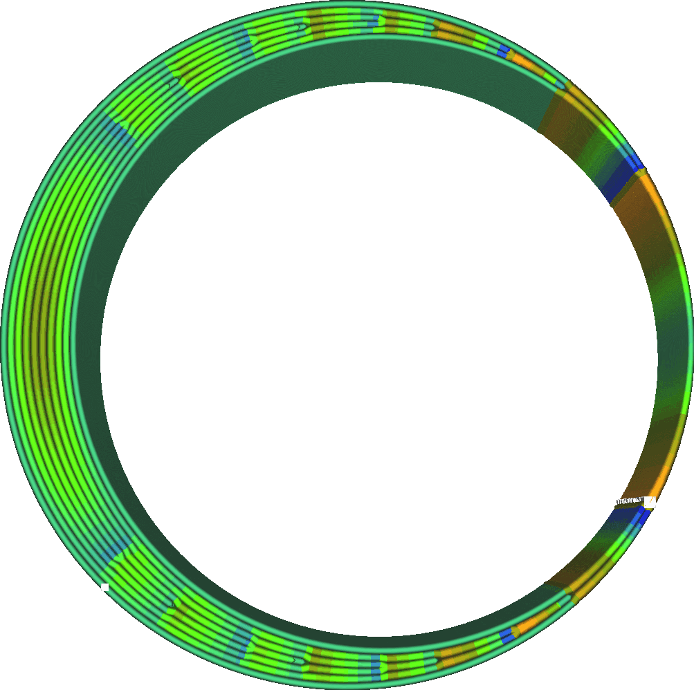

Nombre de distributions des parois
====
Cura peut ajuster la largeur des lignes des parois pour mieux s'adapter à la forme que vous imprimez, mais il n'est pas obligé d'ajuster chaque paroi de la même manière. Il préfère modifier la largeur des parois plus vers l'intérieur du modèle. Ce paramètre détermine le nombre de cordons, en comptant de l'intérieur vers l'extérieur, qui sont ajustés pour s'adapter à l'espace disponible.

<!--screenshot {
"image_path": "wall_distribution_count_1.png",
"models": [
	{
		"script": "misaligned_ring.scad",
		"transformation": ["scale(2)"]
	}
],
"camera_position": [-11, 0, 111],
"settings": {
	"wall_line_count": 5,
	"wall_distribution_count": 1
},
"colour_scheme": "line_width",
"colours": 128
}-->
<!--screenshot {
"image_path": "wall_distribution_count_5.png",
"models": [
	{
		"script": "misaligned_ring.scad",
		"transformation": ["scale(2)"]
	}
],
"camera_position": [-11, 0, 111],
"settings": {
	"wall_line_count": 5,
	"wall_distribution_count": 5
},
"colour_scheme": "line_width",
"colours": 128
}-->

Les parois à largeur variable sont plus difficiles à imprimer que les simples parois à largeur constante. Il faut un certain temps pour ajuster le débit de la buse, et pour faire la transition, il faut aussi faire quelques angles aigus qui peuvent provoquer des vibrations parasites. Il est préférable de faire tout cela le plus loin possible de l'extérieur, là où cela serait visible sur la surface de l'impression. Cura concentrera donc les ajustements de largeur de ligne sur les parois les plus internes.

D'un autre côté, la concentration de la variation signifie également que les lignes du milieu auront des largeurs très divergentes. En répartissant cette variation sur un plus grand nombre de lignes, l'amplitude des variations peut être plus faible, ce qui réduit l'impact de la largeur variable des lignes au lieu de la cacher à l'intérieur.

Ce paramètre permet de sélectionner un certain nombre de corons de l'intérieur parmi lesquels la largeur de ligne peut être ajustée pour remplir l'espace disponible. Cela compte dans les deux sens à partir du centre, donc si ce paramètre est réglé sur 2, jusqu'à 4 murs peuvent être ajustés au centre. L'ajustement n'est pas non plus réparti uniformément entre ces cordons. Les cordons du centre seront toujours légèrement plus ajustés que les cordons plus proches de l'extérieur.

Dans la mesure du possible, la paroi extérieure est toujours maintenue à la largeur de ligne nominale. Cette paroi a une telle influence sur la qualité de l'impression qu'elle est maintenue à une largeur de ligne constante afin de rendre la surface aussi lisse que possible. Ce n'est que si la pièce devient si mince qu'elle n'est constituée que de parois extérieures que celles-ci seront ajustées.

En pratique, cacher les imperfections au centre est presque toujours une meilleure stratégie que de les répartir sur plusieurs cordons. Par conséquent, il est préférable de maintenir ce paramètre aussi bas que possible. Lorsque vous travaillez avec des matériaux difficiles à extruder ou à modifier, comme les matériaux flexibles, il est utile d'augmenter ce paramètre pour réduire les changements de flux. Cependant, il ne peut jamais empêcher complètement ces changements de flux.

**Ce paramètre ne s'applique pas seulement aux parois normales, mais aussi aux parois à contour supplémentaire, aux parois de soutien, aux parois de remplissage et aux motifs concentriques.**
