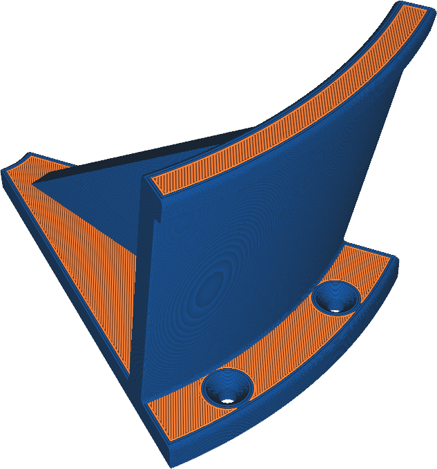

Extrudeuse de paroi
====
Si votre imprimante dispose de plusieurs extrudeuses, vous pouvez choisir de n'imprimer que les murs avec une autre extrudeuse.

L'impression des murs avec une autre extrudeuse peut avoir plusieurs objectifs :
* Un simple effet visuel en imprimant la paroi extérieure avec une couleur différente.
* Les parois peuvent être imprimées avec un matériau qui permet d'obtenir de meilleurs détails mais qui présente des propriétés de résistance indésirables pour le remplissage.
* Les parois peuvent être imprimées avec un matériau flexible pour obtenir une texture plus douce sur votre impression, et pour obtenir plus de friction / adhérence.
* La paroi peut être imprimée avec un matériau ayant un coefficient de frottement plus faible, pour permettre aux pièces mobiles de glisser plus facilement sur la surface.
