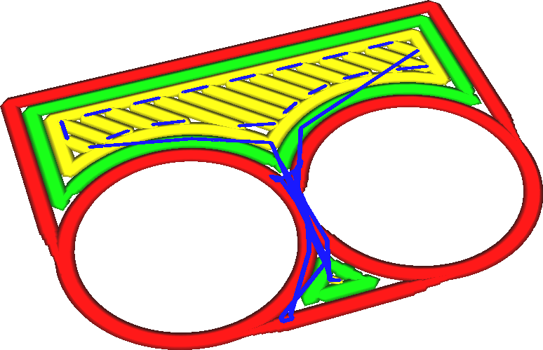
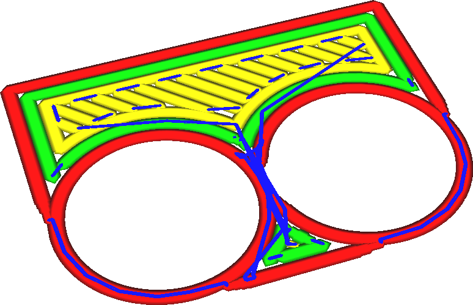

Débit minimal de la paroi
===

La compensation des chevauchements des lignes de mur réduira le débit de certains des murs. Cela peut être problématique, car cela peut réduire le débit arbitrairement faible, jusqu'à 1 % si les parois se chevauchent presque complètement. L'impression à des débits extrêmement faibles ne fonctionne pas bien. Elle a tendance à former un motif de gouttelettes au lieu de lignes d'extrusion continues.

Ce réglage transformera les lignes à débit extrêmement faible en mouvements de translation, faisant effectivement passer leur débit à 0 %. La matière continuera à suinter comme dans les mouvements de déplacement normaux, mais ne formera pas de perles.

La buse suivra toujours le tracé de la paroi afin de suinter au bon endroit.

En augmentant ce réglage, vos murs seront plus fins que souhaité. Au lieu de tracer des lignes très fines, vous ne dessinez plus rien. Techniquement, il s'agit d'une sous-extrusion, ce qui fait que votre pièce est plus mince que souhaité. Cependant, le mur n'aurait pas bien imprimé de toute façon. Au lieu de dessiner une longue ligne de points ou de perles sur le mur, rien ne sera imprimé, ce qui rendra le mur un peu plus lisse.

Réglez ce paramètre sur le débit minimum de la paroi que votre buse peut atteindre sans former de gouttelettes. En général, ce taux est d'environ 60 %. Si la largeur des lignes était réduite en dessous de 60%, ces gouttelettes se formeraient, il est donc préférable de transformer ces lignes en mouvements de déplacement. Si vous imprimez à des hauteurs de couche plus importantes ou si vous utilisez des lignes de paroi plus épaisses, vous pouvez peut-être réduire un peu ce réglage pour obtenir une plus grande précision dimensionnelle.
