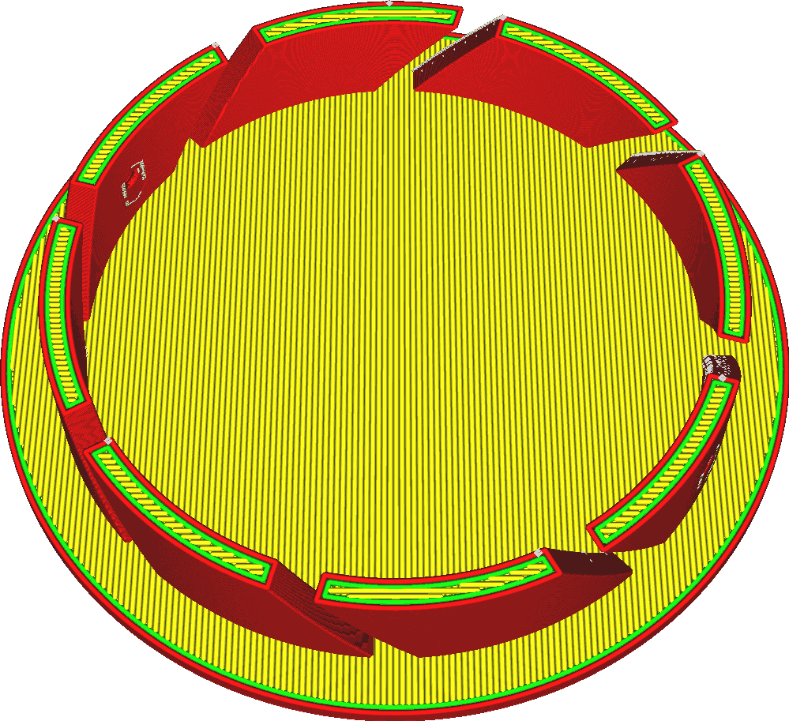

Ce paramètre détermine l'épaisseur du mur autour de l'impression. Enfin, il permet d'ajuster le nombre de parois intérieures pour obtenir l'épaisseur souhaitée.

L'épaisseur de la paroi doit être un multiple de la largeur de la ligne de paroi. Si elle ne l'est pas, elle sera arrondie pour être un multiple exact. Gardez cependant à l'esprit qu'une des parois sera une paroi extérieure, et le reste sera une paroi intérieure. Ces murs peuvent avoir des largeurs de ligne différentes.

L'épaisseur des parois est un facteur important dans la force de l'impression. Comme les murs sont adjacents, ils peuvent se renforcer mutuellement, ce qui donne une partie plus solide. Pour des empreintes plus grandes, cela peut être un moyen beaucoup plus efficace d'obtenir un objet fort que d'ajuster le remplissage, en fonction de la forme.

Augmenter l'épaisseur de la paroi le fera :
* Augmenter considérablement la résistance de l'impression.
* Réduire l'effet de brillance lorsque le motif de remplissage est visible à l'extérieur.
* Améliorer les surplombs, car les lignes de la paroi sont généralement plus orientées vers leur point de repos le plus proche.
* Rendre le modèle étanche plus facilement.
* Augmenter considérablement le temps d'impression et l'utilisation du matériel d'impression.
