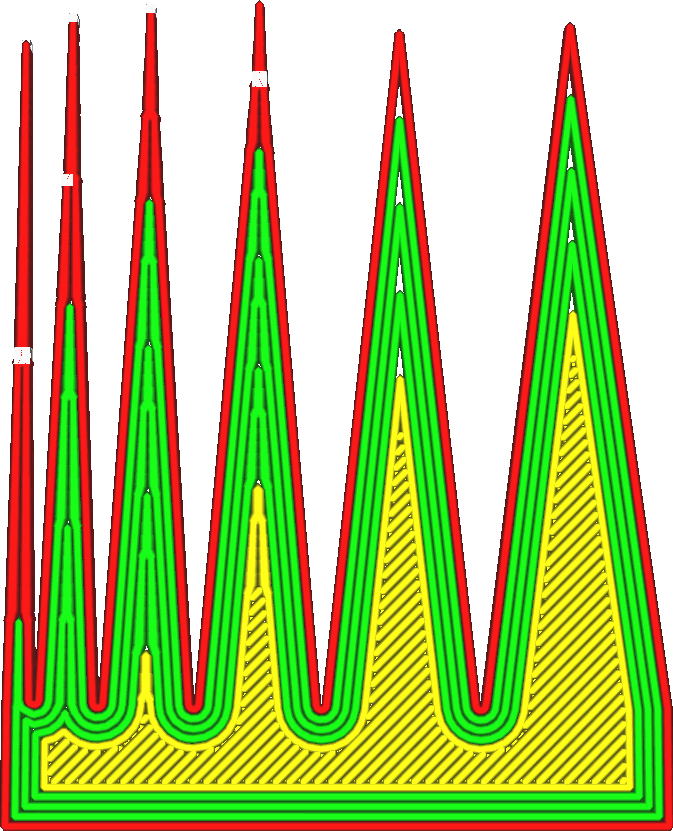

Angle du seuil de transition de la paroi
====
Cet angle indique l'angle à partir duquel Cura commence à créer des transitions pour remplir correctement l'espace. Tous les angles qui sont plus aigus que cet angle seront remplis de lignes de largeur variable.

<!--screenshot {
"image_path": "wall_transition_angle.png",
"models": [{"script": "sharpening_corners.scad"}],
"camera_position": [0, 11, 106],
"settings": {
	"wall_transition_angle": 11,
	"wall_line_count": 4
},
"colours": 64
}-->

Ce paramètre permet d'activer ou de désactiver la largeur variable des lignes pour certains angles. Si deux murs opposés sont presque parallèles, plus petits que l'angle spécifié dans ce paramètre, l'espace entre eux est rempli de lignes dont la largeur peut varier. S'ils forment un angle plus grand l'un par rapport à l'autre, l'espace entre eux est rempli de murs de largeur constante.

Comme toujours, il s'agit d'un compromis. L'utilisation d'une largeur variable présente certains avantages, tels que:
* Il ne laisse aucun vide entre les lignes.
* Il ne remplit pas le même espace plusieurs fois.
* Les dimensions de l'impression seront plus précises à cet endroit..

Cependant, elle présente également certains inconvénients:
* Il introduit des coins dans les pièces fines qui peuvent apparaître comme des ondulations à la surface..
* Cela crée des déplacements supplémentaires.
* L'imprimante peut ne pas modifier avec précision la largeur de la ligne en succession rapide..

Dans la pratique, il est bon de faire en sorte que cet angle soit suffisamment grand pour réduire la taille des espaces dans les angles aigus, comme on peut le voir dans la vue en plan, mais aussi petit que possible par ailleurs. Un angle plus petit donne généralement à la surface un aspect plus lisse.

Il n'est pas possible de réduire l'angle à 0° pour éliminer complètement les largeurs de ligne variables. Les murs parallèles opposés verront toujours leur largeur de ligne ajustée pour s'adapter à l'espace.

**Ce paramètre ne s'applique pas seulement aux parois normales, mais aussi aux parois à contour supplémentaire, aux parois de soutien, aux parois de remplissage et aux motifs concentriques.**
